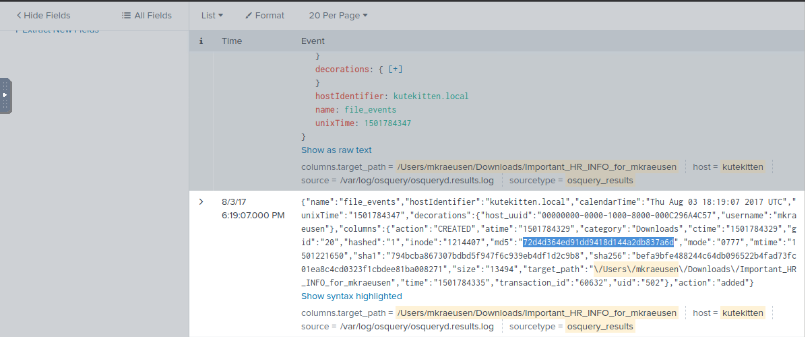
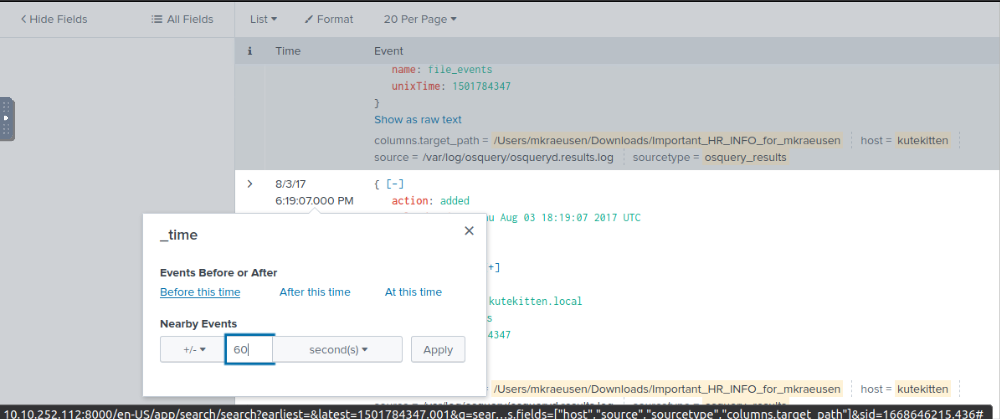

# USB attack investigation

**Mallory's critical PowerPoint presentation on her MacBook gets encrypted by ransomware on August 18. What is the name of this file after it was encrypted?**

    index="botsv2" host="MACLORY-AIR13" (*.ppt OR *.pptx)
	
Answer: `Frothly_marketing_campaign_Q317.pptx.crypt_`

**There is a Games of Thrones movie file that was encrypted as well. What season and episode is it?**

        index="botsv2" host="MACLORY-AIR13" sourcetype=ps *.crypt_ NOT *.pdf
	
Answer: `S07E02`

**Kevin Lagerfield used a USB drive to move malware onto kutekitten, Mallory's personal MacBook. She ran the malware, which obfuscates itself during execution. Provide the vendor name of the USB drive Kevin likely used. Answer Guidance: Use time correlation to identify the USB drive.**

    index="botsv2" host="kutekitten" "\\/Users\\/mkraeusen" sourcetype=osquery_results "columns.target_path"="/Users/mkraeusen/Downloads/Important_HR_INFO_for_mkraeusen"

| 
|:--:|
| `72d4d364ed91dd9418d144a2db837a6d` MD5 hash |

* [VirusTotal->](https://www.virustotal.com/gui/file/befa9bfe488244c64db096522b4fad73fc01ea8c4cd0323f1cbdee81ba008271).

The device was infected before this event, so change the query to (but do NOT enter yet) 

    index="botsv2" host="kutekitten" usb

In the still listed events from the previous query:

| 
|:--:|
| Go back to the bottom and apply 60 seconds before that first event |

Search in the events for `vendor_id` and use it to find the vendor name.

* [Device Hunt ->](https://devicehunt.com/)

Answer: `Alcor Micro Corp.`

**What programming language is at least part of the malware from the question above written in?**

Answer: `perl`

**When was this malware first seen in the wild? Answer Guidance: YYYY-MM-DD**

Answer: `2017-01-17`

**The malware infecting kutekitten uses dynamic DNS destinations to communicate with two C&C servers shortly after installation. What is the fully-qualified domain name (FQDN) of the first (alphabetically) of these destinations?**

* [Hybrid analysis of the hash ->](https://www.hybrid-analysis.com/sample/befa9bfe488244c64db096522b4fad73fc01ea8c4cd0323f1cbdee81ba008271?environmentId=300)
	
Answer: `eidk.duckdns.org`

**From the question above, what is the fully-qualified domain name (FQDN) of the second (alphabetically) contacted C&C server?**

Answer: `eidk.hopto.org`
