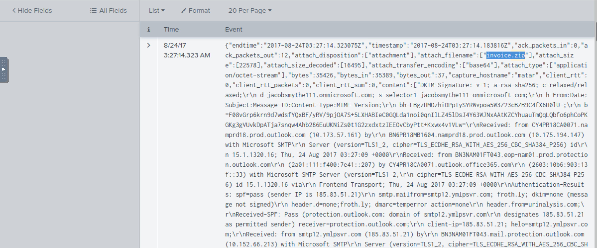
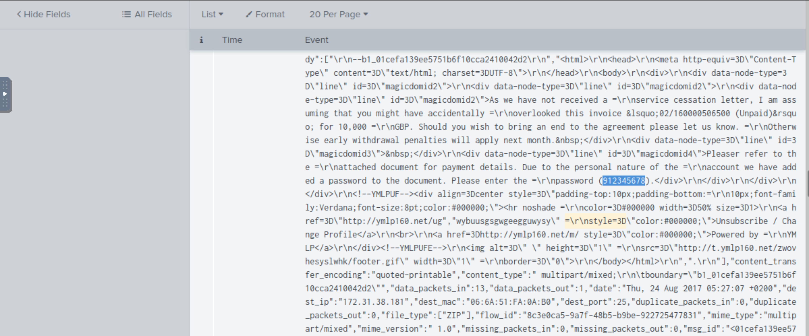
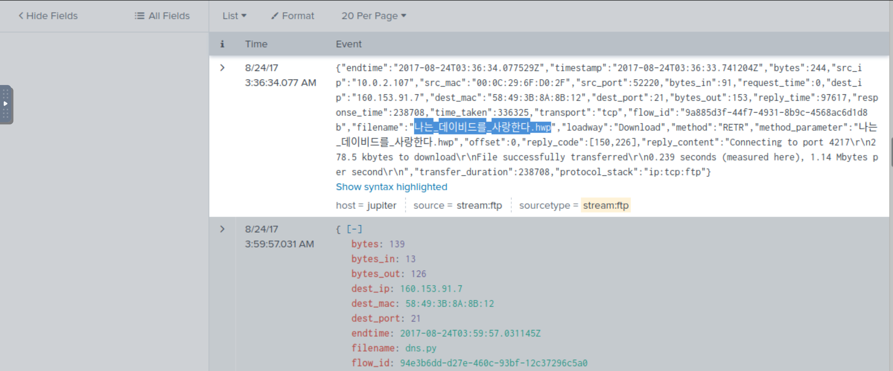
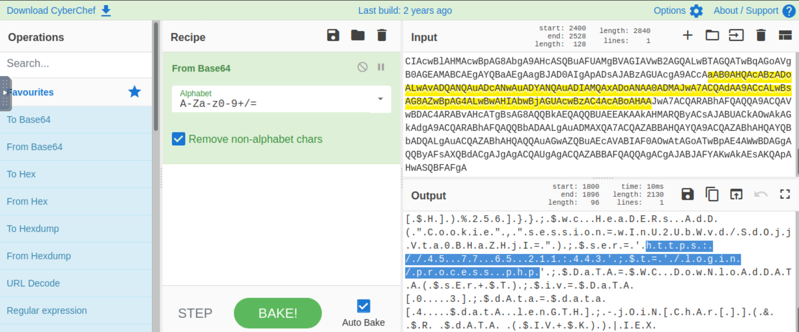

# Investigating FTP

**A Federal law enforcement agency reports that Taedonggang often spear phishes its victims with zip files that have to be opened with a password. What is the name of the attachment sent to Frothly by a malicious Taedonggang actor?**

    index="botsv2" sourcetype="stream:SMTP" *.zip | reverse

The second email looks promising. Open the raw text, and bingo!

|  |
|:------------------------------------------------:|
|              Answer: `invoice.zip`               |

**What is the password to open the zip file?**

Scroll further down:

|  |
|:------------------------------------------------:|
|               Answer: `912345678`                |

**The Taedonggang APT group encrypts most of their traffic with SSL. What is the "SSL Issuer" that they use for the majority of their traffic? Answer guidance: Copy the field exactly, including spaces.**

The IP address used here was identified in [Detecting SQL and XSS web application attacks](200.md).

	index="botsv2" sourcetype="stream:TCP" 45.77.65.211 

Answer: `C = US`

**What unusual file (for an American company) does `winsys32.dll` cause to be downloaded into the Frothly environment?**

    index="botsv2" sourcetype="stream:FTP" method=RETR 
    | reverse

|  |
|:------------------------------------------------:|
|    Answer: `나는_데이비드를_사랑한다.hwp`    |

**What is the first and last name of the poor innocent sap who was implicated in the metadata of the file that executed PowerShell Empire on the first victim's workstation? Answer example: John Smith**

* [Hybrid Analysis ->](https://www.hybrid-analysis.com/sample/d8834aaa5ad6d8ee5ae71e042aca5cab960e73a6827e45339620359633608cf1/598155a67ca3e1449f281ac4)
* [VirusTotal ->](https://www.virustotal.com/gui/file/d8834aaa5ad6d8ee5ae71e042aca5cab960e73a6827e45339620359633608cf1/detection)

Answer: `Ryan Kovar`

**Within the document, what kind of points is mentioned if you found the text?**

* [Any.run ->](https://app.any.run/tasks/15d17cd6-0eb6-4f52-968d-0f897fd6c3b3)
	
Answer: `CyberEastEgg`

**To maintain persistence in the Frothly network, Taedonggang APT configured several Scheduled Tasks to beacon back to their C2 server. What single webpage is most contacted by these Scheduled Tasks? Answer example: `index.php` or `images.html`**

    index="botsv2" schtasks.exe sourcetype="XmlWinEventLog:Microsoft-Windows-Sysmon/Operational" 
    | dedup ParentCommandLine 
    | table ParentCommandLine CommandLine

That gives path to query in registry:

    index="botsv2" source="winregistry" "\\Software\\Microsoft\\Network"

For these events, decode the base64 data in cyberchef, until answer is found.

|  |
|:------------------------------------------------:|
|              Answer: `process.php`               |

