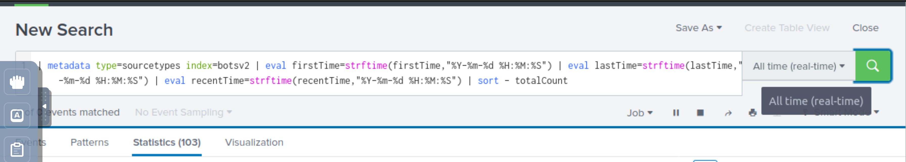

# Data dive

## BOTSv2 Dataset

The data included in this app was generated on August 2017 by members of Splunk's Security Specialist team - Dave 
Herrald, Ryan Kovar, Steve Brant, Jim Apger, John Stoner, Ken Westin, David Veuve and James Brodsky. They stood 
up a few lab environments connected to the Internet. Within the environment they had a few Windows endpoints 
instrumented with the Splunk Universal Forwarder and Splunk Stream. The forwarders were configured with best 
practices for Windows endpoint monitoring, including a full Microsoft Sysmon deployment and best practices for 
Windows Event logging. The environment included a Palo Alto Networks next-generation firewall to capture traffic 
and provide web proxy services, and Suricata to provide network-based IDS. 

## Persona

In this exercise, you assume the persona of Alice Bluebird, the analyst who successfully assisted Wayne Enterprises 
and was recommended to Grace Hoppy at Frothly (a beer company) to assist them with their recent issues.

## Events

The SPL (Splunk Search Processing Language) command metadata can be used to search for the same kind of information 
that is found in the Data Summary, with the bonus of being able to search within a specific index, if desired. 
All time-values are returned in EPOCH time, so to make the output user readable, the eval command should be used to 
provide more human-friendly formatting.

In this example, we will search the `botsv2 index` and return a listing of all the source types that can be found 
as well as a count of events and the first time and last time seen.

Metadata command:

    | metadata type=sourcetypes index=botsv2 | eval firstTime=strftime(firstTime,"%Y-%m-%d %H:%M:%S") | eval lastTime=strftime(lastTime,"%Y-%m-%d %H:%M:%S") | eval recentTime=strftime(recentTime,"%Y-%m-%d %H:%M:%S") | sort - totalCount

|  |
|:------------------------------------------------------------:|
|              All Time. Set it to OTHER:ALL TIME              |

## Resources

* [BOTSv2 Dataset](https://github.com/splunk/botsv2)
* [Splunk Search Reference metadata](http://docs.splunk.com/Documentation/Splunk/latest/SearchReference/Metadata)
* [MetaData > MetaLore](https://www.splunk.com/blog/2017/07/31/metadata-metalore.html)
* [Boss of the SOC 2.0 Dataset, Questions and Answers Open-Sourced and Ready for Download](https://www.splunk.com/en_us/blog/security/boss-of-the-soc-2-0-dataset-questions-and-answers-open-sourced-and-ready-for-download.html)
