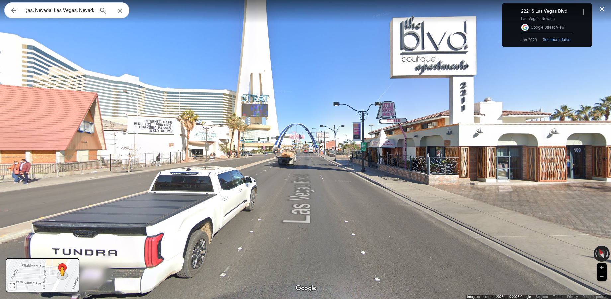
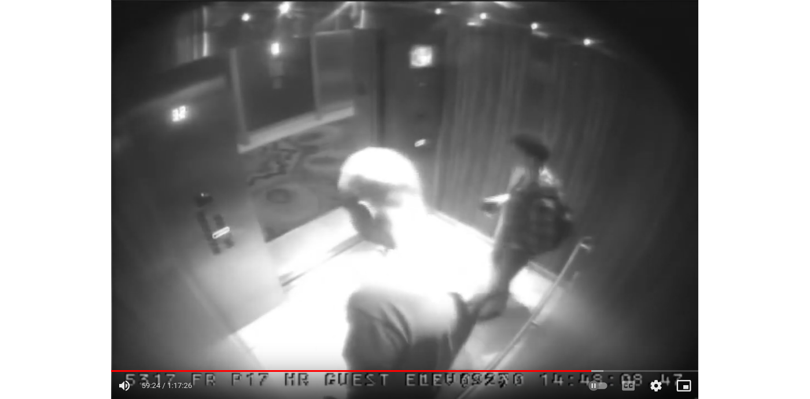
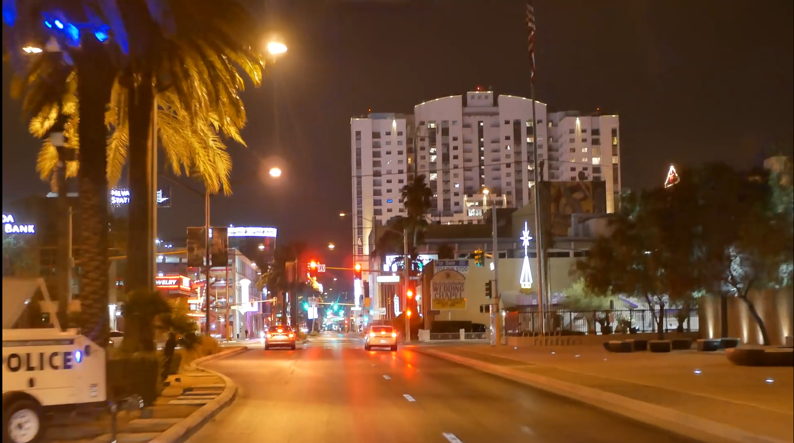

# CaseVegas

## Scenario

In [this CyberDefenders challenge](https://cyberdefenders.org/blueteam-ctf-challenges/70) you are a SOC analyst, and you have been instructed to find a suspect who was employed in a major hotel chain and was responsible for the theft of US$ 3.5 million from his employers.

When you were given the instruction, you were busy with another investigation and immediately abandoned that to start this new investigation. You were also meant to be home hours ago to take your loved one to a nice restaurant for a well-deserved dinner and relaxation time.

During the investigation, your attempt to find the suspect was recorded in the included video. Analyze the video and other files and try to extract answers for some of the case questions.

## Instructions:

* Unzip the challenge (pass: cyberdefenders.org)
* Use a media player like VLC so you can increase video playing speed to save your time.
* We recommend going through all questions once before answering questions. This way, you can watch the video evidence file once and extract answers.

## Tools used

* Google maps
* DuckDuckGo
* Google Street View

## Questions

***Q1 File->Vehicle-number.png: At which minute of the video was the vehicle observed?***

35 minutes

***Q2 File->Vehicle-number.png: What is the zip code of the place where the vehicle was observed in the video.?***

[Address OASIS Hotel on the left in the screen](https://oasisatgoldspike.com/contact/)

***Q3 File->Chapel: This chapel has a live webcam. What is the name of the chapel?***

At 27:33 in the vid, the name can be read. Officially it is called [The Little Chapel of Hearts](https://www.google.com/maps/@36.1455487,-115.1560703,3a,75y,27.84h,90t/data=!3m7!1e1!3m5!1spiaCOML-_7GvAtLe0Cg_uw!2e0!6shttps:%2F%2Fstreetviewpixels-pa.googleapis.com%2Fv1%2Fthumbnail%3Fpanoid%3DpiaCOML-_7GvAtLe0Cg_uw%26cb_client%3Dsearch.gws-prod.gps%26w%3D211%26h%3D120%26yaw%3D27.84077%26pitch%3D0%26thumbfov%3D100!7i16384!8i8192?entry=ttu), but the answer to the question that worked was Elvis Wedding Chapel.

***Q4 File->Chapel: What strip hotel does the chapel have a view of?***

***Q5 What date did the Mandalay Bay shooting take place?***

[01/10/2017](https://en.wikipedia.org/wiki/2017_Las_Vegas_shooting)

***Q6 On 30/09/2017 at 14:47, Stephen Paddock was seen on CCTV footage. Where was he?***

In the [Footage of Stephen Paddock before October 1 shooting](https://www.youtube.com/watch?v=WpiDHq5atpg) at 59:24, we can see him in an elevator:

***Q7 File->Vehicle.png: This vehicle may be related to our investigation. What place did it go to?***

In the video given by the challenge at 30:52 minutes, the car turns right behind the Tux & Gown.

***Q8  Find MGM financial report in the form of a PDF document (not website) which contains the words: 'Consolidated net revenues increased 13% compared to the prior-year Quarter to $3.2 billion' Submit the URL as an answer.***

Don't try with DuckDuckGo. [Use Google](https://www.google.com/search?q=Consolidated+net+revenues+increased+13%25+compared+to+the+prior-year+quarter+to+%243.2+billion+pdf).

***Q9  File->Number: What is the complete number?***

From 33:12 onward, look behind the "Wedding Chapel sign":

***Q10 File->Number: Who is the number's owner?***

[DuckDuckGo 702-735-5700 Vegas](https://duckduckgo.com/?q=702-735-5700+Las+Vegas)

***Q11 What is New York-New York?***

[DuckDuckGo New York-New York Las Vegas](https://duckduckgo.com/?q=New+York-New+York+Las+Vegas)

***Q12 In 2018, a famous hacking conference was held in Las Vegas. Who was the keynote speaker?***

BlackHat 2018 keynote speaker

***Q13 File->Devil.png: What does this belong to? The Devil is in the detail. Provide the tower name.***

From 34:00 onward look in Tower at windows. It is the [Ogden](https://ogdenlv.com/).

***Q14  At which minute of the video was The Deuce (Las vegas bus) observed?***

34 minutes

***Q15  File->Location: What does this belong to?***

At 25:22, on the left. Use the full name of the Strat.

***Q16 The sign at 36.131749, -115.164647 is advertising what show?***

Use Google Street View, then at 21:34 in the vid it is readable.

***Q17  Files->Person-2: At which minute of the video did you see this person?***

At 11:03 on the right.

***Q18 Facebook ID 250240925003365 is linked to a criminal group. What are they called?***

[Facebook ID 250240925003365](https://www.facebook.com/250240925003365/)
