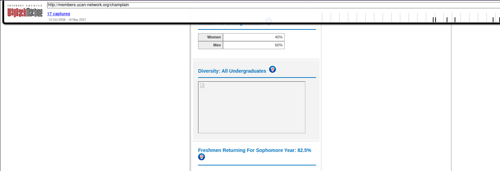

# Intel101

## Scenario

[This CyberDefenders challenge](https://cyberdefenders.org/blueteam-ctf-challenges/38) is an open-source intelligence (OSINT) exercise to practice mining and analyzing public data to produce meaningful intel when investigating external threats as a security blue team analyst.

## Tools used

* whois
* DuckDuckGo
* Wayback Machine
* Google Lens

## Questions

***Q1 Who is the Registrar for jameskainth.com?*** 

```text
sansforensics@siftworkstation: ~/Desktop/cases/c22-Intel101/Intel101
$ whois jameskainth.com | grep Registrar:
   Registrar: NameCheap, Inc.
Registrar: NAMECHEAP INC
```

***Q2 You get a phone call from this number: 855-707-7328, they were previously known by another name? (No spaces between words)***

[DuckDuckGo 855-707-7328](https://duckduckgo.com/?q=855-707-7328) leads to [Spectrum](https://en.wikipedia.org/wiki/Spectrum_(brand)), leads to [Wikipedia Time Warner Cable](https://en.wikipedia.org/wiki/Time_Warner_Cable).

***Q3 What is the Zoom meeting id of the British Prime Ministers Cabinet Meeting?*** 

[The UK Cabinet is meeting on Zoom… here’s the meeting ID](https://grahamcluley.com/uk-cabinet-zoom-meeting/)

***Q4 What Percentage of full-time degree-seeking freshmen from the fall of 2018 re-enrolled to Champlain in the fall of 2019?*** 

It's getting harder: [Wayback machine for http://members.ucan-network.org/champlain March snapshot](https://web.archive.org/web/20200307072404/http://members.ucan-network.org/champlain)



***Q5 In 1998 specifically on February 12th, Champlain was planning on adding an exciting new building to its campus. Back then, it was called “The Information Commons”. Can you find a picture of what the inside would look like? Upload the sha256 hash here.*** 

[Wayback machine for Champlain College Information Commons New Technology/Library Building 1998 February snapshot](https://web.archive.org/web/19980212103501/http://www.champlain.edu/ic/)

Download and calculate hash:

```text
nina@tardis:~/Pictures$ sha256sum inside1.jpg 
f4952b314eb15acf0eec79c954f83881c17d50d2b5922ee37e8fc5e5cd1aeac2  inside1.jpg
```

***Q6 One of Champlain College's Cyber Security Faculty got a bachelor's degree in arts from this Ohioan university. Who was the other faculty member who studied there? (FirstName LastName - two words)***

[Todd](https://www.champlain.edu/academics/our-faculty/champlain-college-online/faculty/schroeder-todd)

***Q7 In 2019 UVM’s Ichthyology Class Had to Name their fish for class. Can you find out what the last person on the public roster named their fish?***

Use [Wayback urls for https://www.uvm.edu/rsenr](https://web.archive.org/web/*/https://www.uvm.edu/rsenr*) to find [Student fish names](https://web.archive.org/web/20220517234353*/http://www.uvm.edu/rsenr/wfb232/studentfishnames2019.xls).

***Q8 Can You Figure Out Which State This Picture Has Been Taken From? See attached photo***

Use [Google Lens](https://lens.google.com/search?ep=gisbubb&hl=nl-BE&re=df&vpw=1280&vph=862&p=AUM6UZBsfYthCI8-h-LZn_MIEvVlsGI_V0OHIsq3NC84CsvDQgalGVUWwlE8R1oH49S03R5gl1yhjGbcMJ0xm0FjLJnKtVl0S6C3ckvTDkBYjKMoe7dFf5fc-M0G1jFxQWnjX_6iCjYQiic6ENFl6fl9G7gU-d9obQA89DU5HUPtAmgJuzKWAwns8iOYSOnlEAv5QMKj0jfGEMB8pbrjLaoE#lns=W251bGwsbnVsbCxudWxsLG51bGwsbnVsbCxudWxsLDEsIkVrY0tKR0l3TTJFelptWmxMVEl6WW1NdE5EazFNeTFpTUdJd0xURmtZMlZtWVRneE0ySTBNUklmWXpreE5tZEpNbE5JYVZWUmIwUk1aa3hPVEZCZlpVOXhUa1ZNUm01U1p3PT0iLG51bGwsbnVsbCxudWxsLG51bGwsbnVsbCxudWxsLFtudWxsLDEyLFtdXV0=).