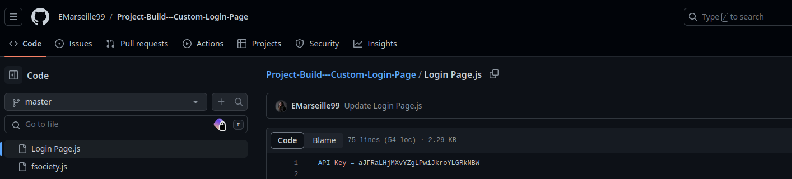
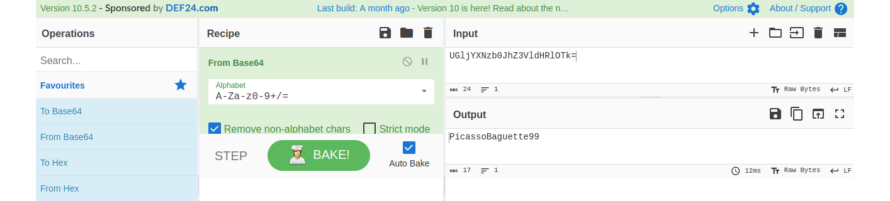

# L’espion

## Scenario

In [this CyberDefenders challenge](https://cyberdefenders.org/blueteam-ctf-challenges/73), You, as a SOC analyst, have been tasked by a client whose network was compromised and brought offline to investigate the incident and determine the attacker's identity.

Incident responders and digital forensic investigators are currently on the scene and have conducted a preliminary investigation. Their findings show that the attack originated from a single user account, probably, an insider.

Investigate the incident, find the insider, and uncover the attack actions.

## Tools used

* DuckDuckGo
* Cyberchef

## Questions

***Q1 File -> Github.txt: What is the API key the insider added to his GitHub repositories?***



***Q2 File -> Github.txt: What is the plaintext password the insider added to his GitHub repositories?*** 

In the same file:

```text
<div class="wrap-input100 validate-input" data-validate = "Valid username is required: FileCubeUser100">

    Username: EMarseille99
    
    <span class="focus-input100"></span>
    <span class="symbol-input100">
    <i class="fa fa-chain" aria-hidden="true"></i>
    </span>
    
</div> 


<div class="wrap-input100 validate-input" data-validate = "Password is required">

    Password: UGljYXNzb0JhZ3VldHRlOTk=
    Password(base64)
    
    <span class="focus-input100"></span>
    <span class="symbol-input100">
    <i class="fa fa-lock" aria-hidden="true"></i>
    </span>
</div>
```



***Q3 File -> Github.txt: What cryptocurrency mining tool did the insider use?***

[xmrig](https://github.com/EMarseille99/xmrig)

***Q4 What university did the insider go to?*** 

[LinkedIn Émilie Marseille](https://www.linkedin.com/in/%C3%A9milie-marseille-4b353a1aa/)

***Q5 What gaming website the insider had an account on?*** 

[emarseille99 on Steam](https://steamcommunity.com/id/emarseille99/)

***Q6 What is the link to the insider Instagram profile?*** 

[Instagram link](https://www.instagram.com/EMarseille99/)

***Q7 Where did the insider go on the holiday? (Country only)***

See [posted picture on instagram](https://www.instagram.com/emarseille99/p/CAjDd_dlHds/)

***Q8 Where is the insider's family live? (City only)***

[Burj Khalifa in photo](https://www.instagram.com/p/CAjCfM1lKhq/)

***Q9 File -> office.jpg: You have been provided with a picture of the building in which the company has an office. Which city is the company located in?*** 

[DuckDuckGo for Alexandra Theater UK](https://duckduckgo.com/?t=ffab&Q=Alexandra+Theater+UK)

***Q10 File -> Webcam.png: With the intel, you have provided, our ground surveillance unit is now overlooking the person of interest's suspected address. They saw them leaving their apartment and followed them to the airport. Their plane took off and has landed in another country. Our intelligence team spotted the target with this IP camera. Which state is this camera in?***

[EarthCam search](https://www.earthcam.com/)

