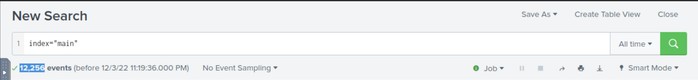
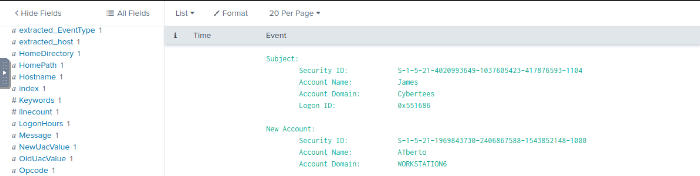
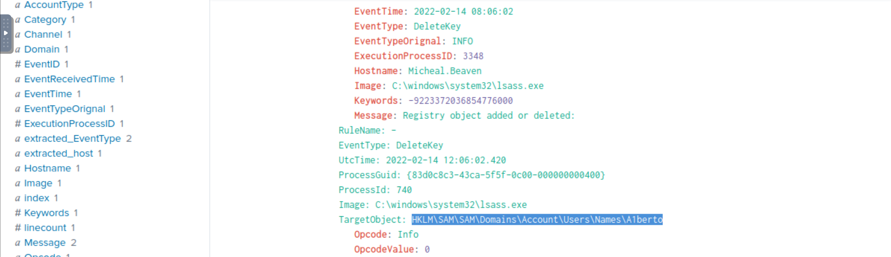
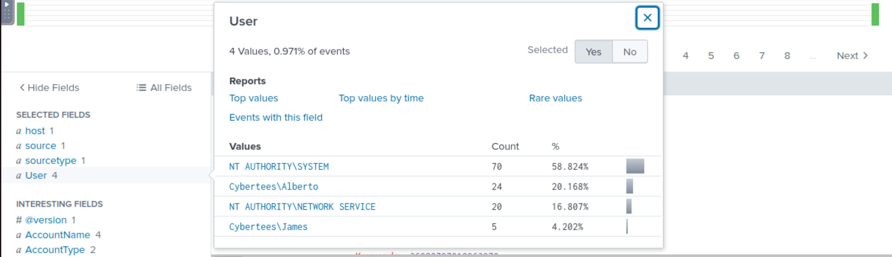
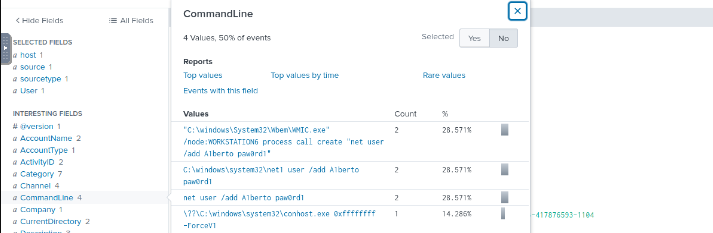
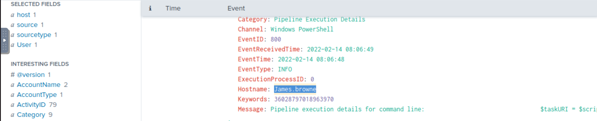
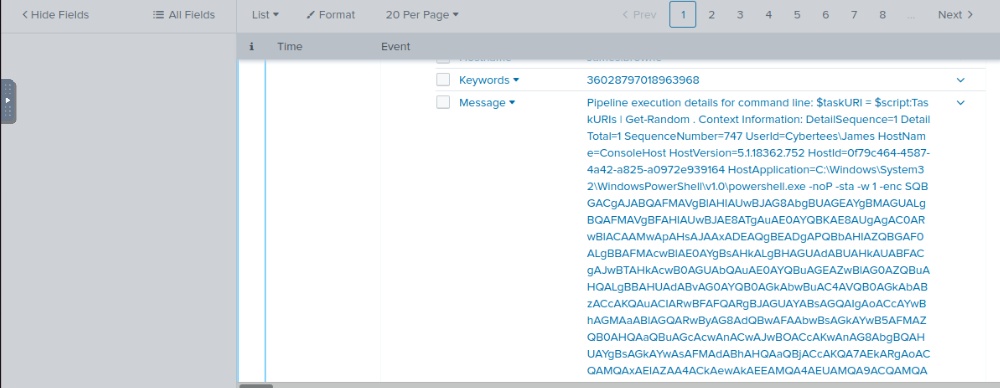
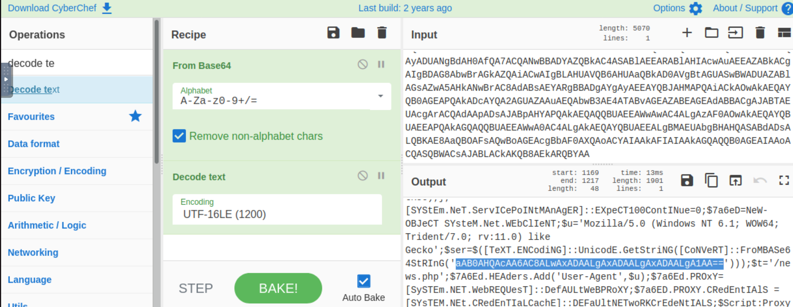
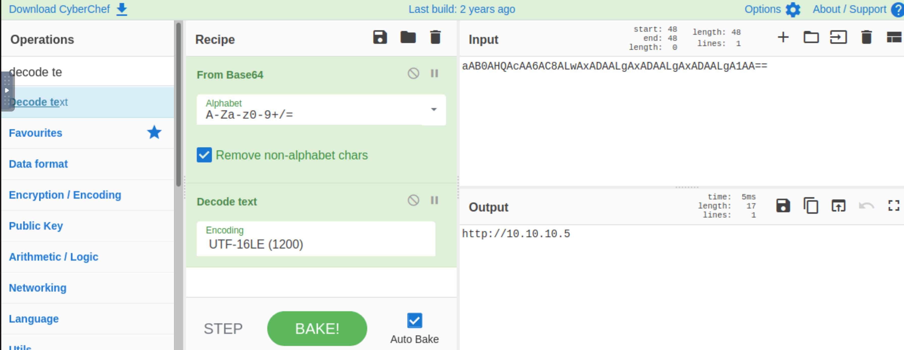
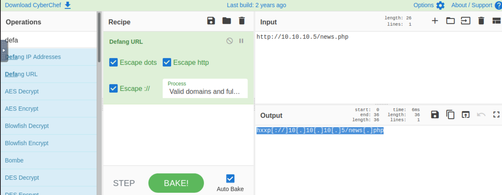

# Investigating with Splunk

SOC Analyst Johny has observed some anomalous behaviours in the logs of a few windows machines. It looks like the 
adversary has access to some of these machines and successfully created some backdoor. His manager has asked him 
to pull those logs from suspected hosts and ingest them into Splunk for quick investigation. Our task as SOC Analyst 
is to examine the logs and identify the anomalies. 

## Questions

**How many events were collected and Ingested in the index main?**

| 
|:--:|
| `12256` |

**On one of the infected hosts, the adversary was successful in creating a backdoor user. What is the new username?**

    index="main" EventID=4720

| 
|:--:|
| `A1berto` |

**On the same host, a registry key was also updated regarding the new backdoor user. What is the full path of that registry key?**

    index="main" A1berto Category="Registry object added or deleted (rule: RegistryEvent)"

| 
|:--:|
| `HKLM\SAM\SAM\Domains\Account\Users\Names\A1berto\` |

**Examine the logs and identify the user that the adversary was trying to impersonate.**

| 
|:--:|
| `Alberto` |

**What is the command used to add a backdoor user from a remote computer?**

    index="main" net user A1berto

| 
|:--:|
| `C:\windows\System32\Wbem\WMIC.exe" /node:WORKSTATION6 process call create "net user /add A1berto paw0rd1"` |

**How many times was the login attempt from the backdoor user observed during the investigation?**

`0`

**What is the name of the infected host on which suspicious Powershell commands were executed?**

    index="main" powershell

| 
|:--:|
| `James.browne` |

**PowerShell logging is enabled on this device. How many events were logged for the malicious PowerShell execution?**

    index="main" EventID=4103

| 
|:--:|
| `79` |

**An encoded Powershell script from the infected host initiated a web request. What is the full URL?**

    index="main" powershell

| 
|:--:|
| Find encoded script in message. |

| 
|:--:|
| Copy encoded script to Cyberchef and decode. |

| 
|:--:|
| Find encoded part of url in script and decode again. Recombine with rest of url. Defang. |

| 
|:--:|
| `hxxp[://]10[.]10[.]10[.]5/news[.]php` |

