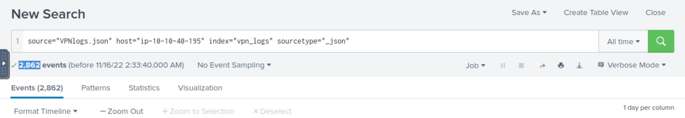
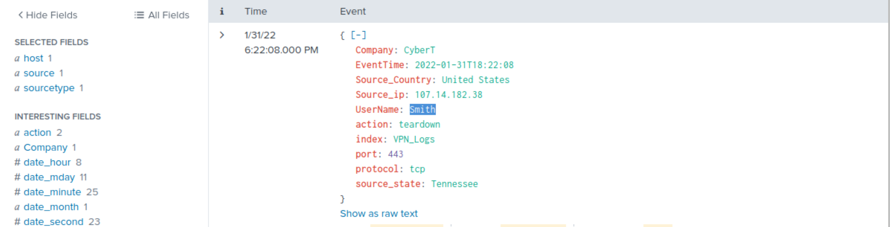
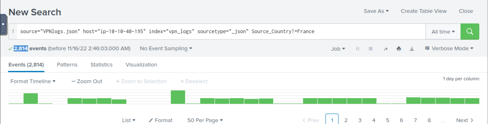
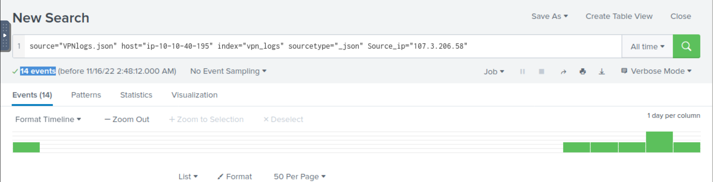

# VPN logs

Upload the `VPN_logs` data in Splunk, and create an index `VPN_Logs`. 

**How many events are present in the log file?**

| 
|:--:|
| Answer: `2862` |

**How many log events by the user Maleena are captured?**

| 
|:--:|
| Answer: `60` |

**What is the name associated with IP `107.14.182.38`?**

| 
|:--:|
| Answer: `Smith` |

**What is the number of events that originated from all countries except France?**

| 
|:--:|
| Answer: ` 2814` |

**How many VPN Events were observed by the IP 107.3.206.58?**

| 
|:--:|
| Answer: `14` |

## More rooms

* [Incident Handling with Splunk](https://tryhackme.com/room/splunk201)
* [Investigating With Splunk](http://tryhackme.com/jr/investigatingwithsplunk)
* [Benign - Challenge](http://tryhackme.com/jr/benign)
* [PoshEclipse - Challenge](http://tryhackme.com/jr/posheclipse)
