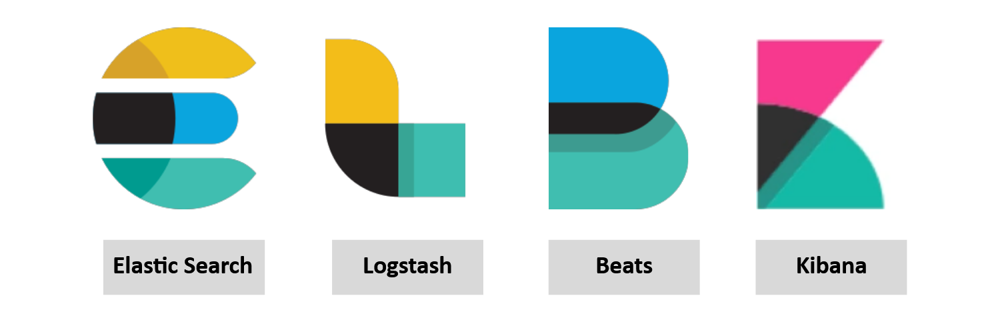
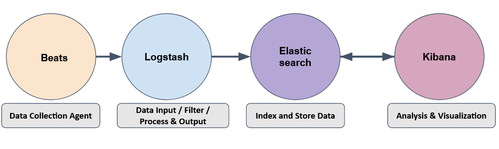

# Elastic stack

## Components

| 
|:--:|
| A collection of different open source components linked together to help users take the data from  any source and in any format and perform a search, analyze and visualize the data in real-time. |

* Elasticsearch is a full-text search and analytics engine used to store JSON-formatted documents. Elasticsearch 
is a component used to store, analyze, perform correlation on the data, etc. Elasticsearch supports RESTFul API to 
interact with the data.
* Logstash is a data processing engine used to take the data from different sources, apply the filter on it or 
normalize it, and then send it to the destination which could be Kibana or a listening port.
* Beats is a host-based agent known as Data-shippers that is used to ship/transfer data from the endpoints to 
elasticsearch. Each beat is a single-purpose agent that sends specific data to the elasticsearch. 
* Kibana is a web-based data visualization that works with elasticsearch to analyze, investigate and visualize the 
data stream in real-time. It allows users to create multiple visualizations and dashboards for better visibility.

## Data flow

| 
|:--:|
| How they work together. |

* Beats is a set of different data shipping agents used to collect data from multiple agents. Like Winlogbeat is used to collect windows event logs, Packetbeat collects network traffic flows.
* Logstash collects data from beats, ports or files, etc., parses/normalizes it into field value pairs, and stores them into elasticsearch.
* Elasticsearch acts as a database used to search and analyze the data.
* Kibana is responsible for displaying and visualizing the data stored in elasticsearch. The data stored in elasticseach can easily be shaped into different visualizations, time charts, infographics, etc., using Kibana.

## Resources

* [Elastic docs: Input plugins](https://www.elastic.co/guide/en/logstash/8.1/input-plugins.html)
* [Elastic docs: Filter plugins](https://www.elastic.co/guide/en/logstash/8.1/filter-plugins.html)
* [Elastic docs: Output plugins](https://www.elastic.co/guide/en/logstash/8.1/output-plugins.html)
