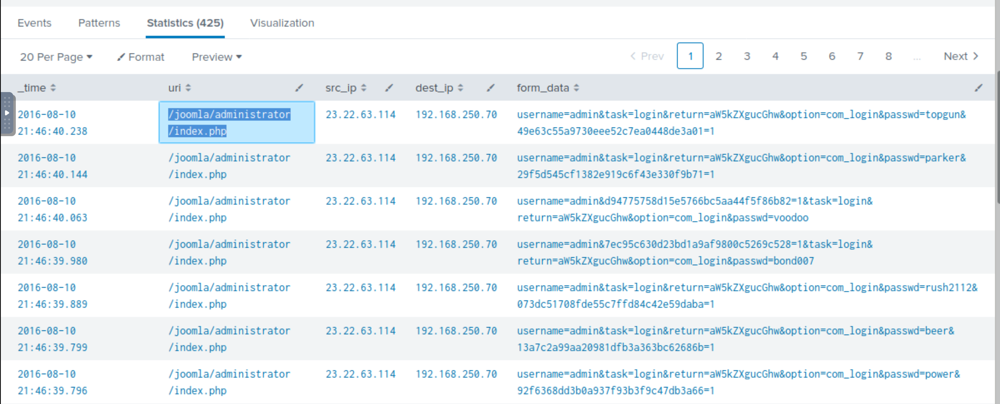
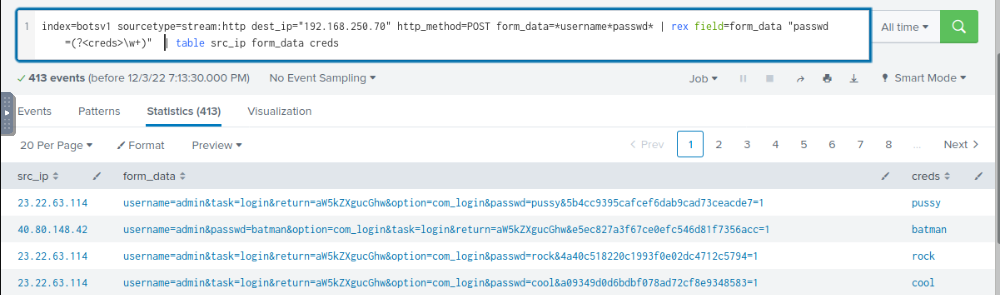

# Exploitation phase

So far:

* We found two IP addresses from the reconnaissance phase with sending requests to our server.
* One of the IPs `40.80.148.42` was seen attempting to scan the server with IP `192.168.250.70`.
* The attacker was using the web scanner `Acunetix` for the scanning attempt.

The attacker needs to exploit the vulnerability to gain access to the system/server. Look at the potential 
exploitation attempt from the attacker against the web server and see if the attacker got successful in exploiting 
or not.

## Count

To see the number of counts by each source IP against the webserver, use search query:

    index=botsv1 imreallynotbatman.com sourcetype=stream* | stats count(src_ip) as Requests by src_ip | sort - Requests

No results. To show requests sent **to** the web server `192.168.250.70`:

    index=botsv1 sourcetype=stream:http dest_ip="192.168.250.70"

20,275 events. To see what kind of traffic is coming through the `POST` requests, narrow down on the field `http_method=POST`:

    index=botsv1 sourcetype=stream:http dest_ip="192.168.250.70" http_method=POST

14,238 events. To narrow down the search even further, to see the requests sent to the login portal:

    index=botsv1 sourcetype=stream:http dest_ip="192.168.250.70" http_method=POST uri="/joomla/administrator/index.php"

425 events. Dig deep into the values contained within the `form_data` field:

    index=botsv1 sourcetype=stream:http dest_ip="192.168.250.70" http_method=POST uri="/joomla/administrator/index.php" | table _time uri src_ip dest_ip form_data

Two interesting fields:

* `username` includes the single username admin in all the events 
* `passwd` contains multiple passwords

## Questions

**What IP address is likely attempting a brute force password attack against `imreallynotbatman.com`?**
, **What was the URI which got multiple brute force attempts?**, and **Against which username was the brute force attempt made?**

|                             |
|:--------------------------------------------------------------------------------:|
| `23.22.63.114` resp. `/joomla/administrator/index.php`, against username `admin` |

This indicates the attacker from the IP `23.22.63.114` was trying to bruteforce the admin password. The time elapsed 
between the multiple events suggests that the attacker was using an automated tool.

## Extracting username and passwd fields using Regex

To display only the logs that contain the `username` and `passwd` values in the `form_data` field by adding `form_data=*username*passwd*` in the search query:

    index=botsv1 sourcetype=stream:http dest_ip="192.168.250.70" http_method=POST uri="/joomla/administrator/index.php" form_data=*username*passwd* | table _time uri src_ip dest_ip form_data

To extract all the password values found against the field `passwd` in the logs, Splunk has a function called `rex`. 
Use `rex field=form_data "passwd=(?<creds>\w+)"` to extract the passwd values only. This will pick the `form_data` 
field and extract all the values found with the field `creds`:

    index=botsv1 sourcetype=stream:http dest_ip="192.168.250.70" http_method=POST form_data=*username*passwd* | rex field=form_data "passwd=(?<creds>\w+)"  | table src_ip creds

The first value shows the attacker used a python script to automate the brute force attack against our server. 
But one request came from a Mozilla browser. WHY?

Add `http_user_agent` field in the search head:

    index=botsv1 sourcetype=stream:http dest_ip="192.168.250.70" http_method=POST form_data=*username*passwd* | rex field=form_data "passwd=(?<creds>\w+)" |table _time src_ip uri http_user_agent creds

## Questions

**What was the correct password for admin access to the content management system running `imreallynotbatman.com`?**, 
**How many unique passwords were attempted in the brute force attempt?**, and **After finding the correct password, 
which IP did the attacker use to log in to the admin panel?**

|  |
|:-----------------------------------------------------:|
|       `batman`, `413-1=412`, and `40.80.148.42`       |

