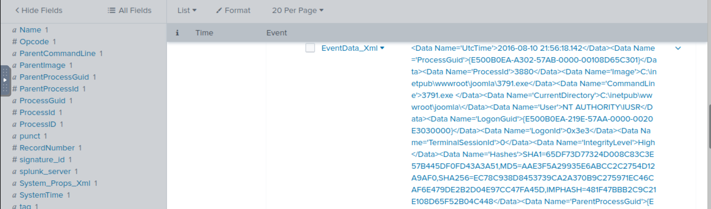
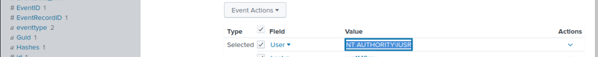
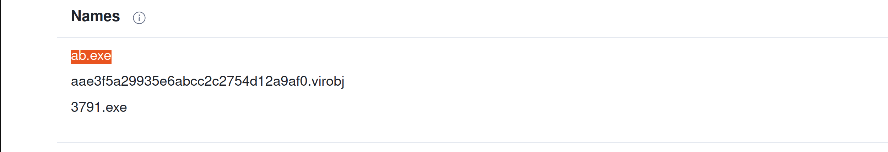

# Installation phase

We found evidence of the webserver `iamreallynotbatman.com` getting compromised via brute-force attack by the attacker 
using a python script to automate getting the correct password. The attacker used the IP 
for the attack and the IP to log in to the server. 

The installation phase investigates any payload/malicious program uploaded to the server from any attacker's IPs 
and installed into the compromised server.

Narrow down any http traffic coming into our server `192.168.250.70` containing the term `.exe`. This query may 
not lead to the findings, but it is good to start from one extension and move forward.

    index=botsv1 sourcetype=stream:http dest_ip="192.168.250.70" *.exe

Look for the fields that could have some values of our interest. Also look at the missing fields and there a field 
`part_filename{}` shows up.

The field `part_filename{}` contains the two file names: an executable file `3791.exe` and a PHP file `agent.php`.

To find if any of these two files came from the IP addresses that were found to be associated with the attack earlier, 
click on the file name, then look for the field `c_ip`.

## Was this file executed on the server after being uploaded?

We have found that file `3791.exe` was uploaded to the server. Was this file executed on the server? 

To narrow down the search query to show the logs from the host-centric log sources:

    index=botsv1 "3791.exe"

Leverage `sysmon` and look at the `EventCode=1` for program execution:

    index=botsv1 "3791.exe" sourcetype="XmlWinEventLog" EventCode=1

## Questions

**Sysmon also collects the Hash value of the processes being created. What is the `MD5` hash of the program `3791.exe`?**

|  |
|:----------------------------------------------:|
|       `AAE3F5A29935E6ABCC2C2754D12A9AF0`       |

**Looking at the logs, which user executed the program `3791.exe` on the server?**

|  |
|:-----------------------------------------------:|
|               `NT AUTHORITY\IUSR`               |

**Search the hash on the virustotal. What other name is associated with this file `3791.exe`?**

|  |
|:---------------------------------------------:|
|                   `ab.exe`                    |

