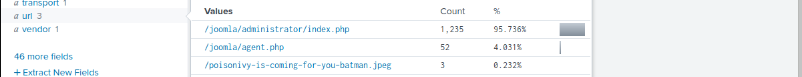

# Action on objectives

As the website was defaced due to a successful attack by the adversary, it would be helpful to understand better 
what ended up on the website that caused defacement.

The first quest could be to figure out the traffic flow.

Examine the Suricata log source and the IP addresses communicating with the webserver `192.168.250.70`.

    index=botsv1 dest=192.168.250.70 sourcetype=suricata

To change the flow direction to see if any communication originates from the server:

    index=botsv1 src=192.168.250.70 sourcetype=suricata

Three external IPs appear, towards which the web server initiates the outbound traffic. There is a large chunk of 
traffic going to these external IP addresses, which could be worth checking.

Pivot into the destination IPs one by one to see what kind of traffic/communication is being carried out:

    index=botsv1 src=192.168.250.70 sourcetype=suricata dest_ip=23.22.63.114

The `url` field shows 2 `.php` files and one `.jpeg` file. This jpeg file looks interesting. 

To see where this jpeg file came from:

    index=botsv1 url="/poisonivy-is-coming-for-you-batman.jpeg" dest_ip="192.168.250.70" | table _time src dest_ip http.hostname url

The end result shows `poisonivy-is-coming-for-you-batman.jpeg` was downloaded from the attacker's host 
`prankglassinebracket.jumpingcrab.com`.

## Questions

**What is the name of the file that defaced the `imreallynotbatman.com` website?**

| 
|:--:|
| `poisonivy-is-coming-for-you-batman.jpeg` |

Fortigate Firewall `fortigate_utm` detected SQL attempt from the attacker's IP `40.80.148.42`. 
**What is the name of the rule that was triggered during the SQL Injection attempt?**

    index=botsv1 src=40.80.148.42 sourcetype=fortigate_utm

Add the `attack` field to the fields and:

| 
|:--:|
| `HTTP.URI.SQL.Injection` |

