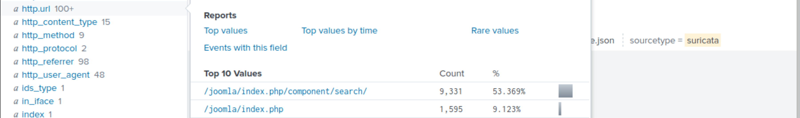

# Reconnaissance phase

Reconnaissance is an attempt to discover and collect information about a target. It could be knowledge about the 
system in use, the web application, employees or location, etc.

Start the analysis by examining any reconnaissance attempt against the webserver `imreallynotbatman.com`.

    index=botsv1 imreallynotbatman.com sourcetype=stream:http

## Questions

    index=botsv1 imreallynotbatman.com src_ip="40.80.148.42" sourcetype=suricata "alert.category"="Attempted Administrator Privilege Gain"

One suricata alert highlighted the CVE value associated with the attack attempt. **What is the CVE value?**

Add `alert` fields and use:

    index=botsv1 imreallynotbatman.com src_ip="40.80.148.42" sourcetype=suricata "alert.category"="Attempted Administrator Privilege Gain"

| 
|:--:|
| `CVE-2014-6271` |

See [CVE-2014-6271 Detail](https://nvd.nist.gov/vuln/detail/CVE-2014-6271), basically, 
[ShellShock](https://www.yeahhub.com/shellshock-vulnerability-exploitation-metasploit-framework/).

**What is the CMS our web server is using?**

    index=botsv1 imreallynotbatman.com sourcetype=stream:http

| 
|:--:|
| `joomla` |

**What is the web scanner the attacker used to perform the scanning attempts?**

| 
|:--:|
| `acunetix` |

**What is the IP address of the server `imreallynotbatman.com`?**

| 
|:--:|
| `192.168.250.70` |

.