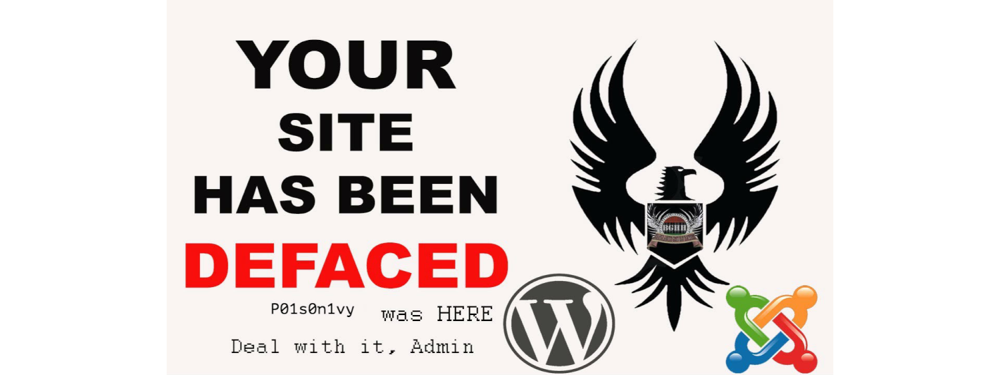
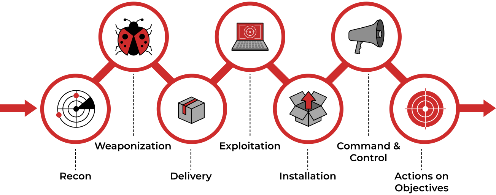

# Scenario

A Big corporate organisation Wayne Enterprises has recently faced a cyber-attack where the attackers broke into their 
network, found their way to their web server, and have successfully defaced their website 
`http://www.imreallynotbatman.com`. 

| 
|:--:|
| Their website is now showing the trademark of the attackers with the message  `YOUR SITE HAS BEEN DEFACED`. |

They have requested "us" to join them as a Security Analyst and help them investigate this cyberattack and find the 
root cause and all the attackers' activities within their network.

The good thing is, that they have Splunk already in place, so we have got all the event logs related to the attacker's 
activities captured. We need to explore the records and find how the attack got into their network and what actions 
they performed. Logs are being ingested from `webserver/firewall/Suricata/Sysmon` etc.

## Cyber Kill Chain

A cyberattack in which the attacker defaced an organisation's website. This organisation has Splunk as a SIEM 
solution setup. Our task as a Security Analysis would be to investigate this cyberattack and map the attacker's 
activities into all 7 of the Cyber Kill Chain Phases. 

| 
|:--:|
| We do not need to follow the sequence of the cyber kill chain during the investigation.  One finding in one phase will lead to another finding that  may have mapped into some other phase. |

This Investigation comes under the Detection and Analysis phase.