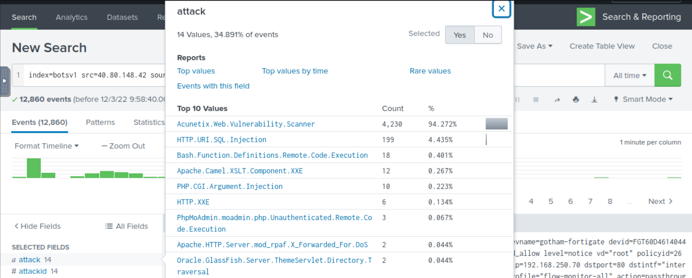

# Weaponisation phase

We have found a domain `prankglassinebracket.jumpingcrab.com` and IP addresses associated with the attacker during 
the investigations. 

In the weaponisation phase, the adversaries would:

* Create Malware/Malicious document to gain initial access/evade detection etc.
* Establish domains similar to the target domain to trick users.
* Create a Command and Control Server for the post-exploitation communication/activity etc.

Use OSINT to find out more about the attacker.

* [Robtex](https://www.robtex.com/) is a Threat Intel site that provides information about IP addresses, domain names, etc. 
* [ThreatCrowd](https://www.threatcrowd.org/) is a Search Engine for Threats that provides intel based on the IP, domain, email address, etc.
* [Virustotal](https://www.virustotal.com/) is an OSINT site used to analyze suspicious files, domains, IP, etc.
* [Domaintools](https://whois.domaintools.com/) gives whois information on sites.

## Questions

**What IP address has `P01s0n1vy` tied to domains that are pre-staged to attack Wayne Enterprises?**

    23.22.63.114

**Based on the data gathered from this attack and common open-source intelligence sources for domain names, what is 
the email address that is most likely associated with the `P01s0n1vy` APT group?**

| 
|:--:|
| `lillian.rose@po1s0nvy.com` |

