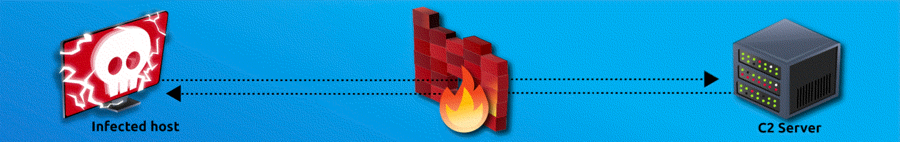

| 
|:--:|
| [THM Room: ItsyBitsy](https://tryhackme.com/room/itsybitsy) |

# Introduction

## What?

Investigating an alert by IDS regarding a potential C2 communication.

## Why?

To find compromise.

## How?

