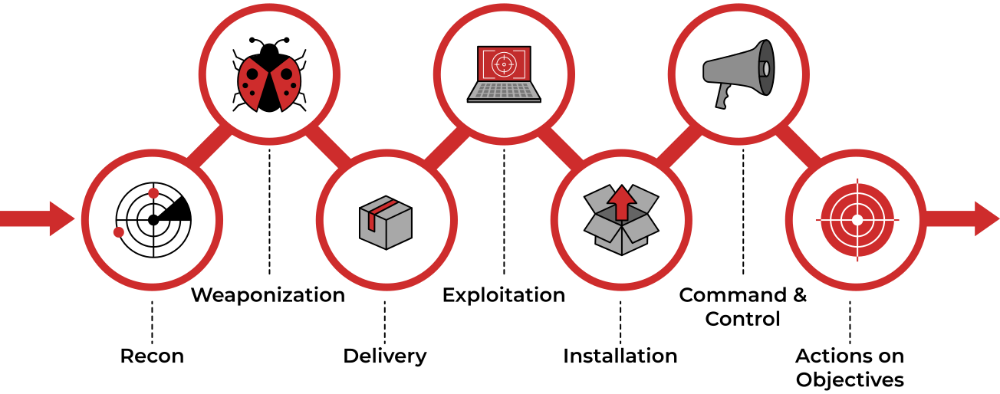

# Cyber kill chain

|                                           |
|:-------------------------------------------------------------------------------------------------------:|
| The Cyber Kill Chain framework is designed for identification and prevention of the network intrusions. |

Lockheed Martin established the Cyber Kill Chain® framework for the cybersecurity industry in 2011 based on the 
military concept. The framework defines the steps used by adversaries or malicious actors in cyberspace.

The cyber kill chain is not outdated. Instead, it has security gaps. And that is akin to "not a bug, a feature". 
These security gaps exist because the model has not been modified since its creation about a decade ago. The model’s 
design works well to protect against malware prevention and detection, which it was designed for. The model's problem 
stems from the fact that it uses an ancient approach to network security, focusing only on malware prevention and 
perimeter security.

* The different stages of the protocol controls does nothing to detect an attacks' progression.
* The model cannot identify insider threats or intrusions with remote access, because these threats do not involve malware or payloads.

## Reconnaissance

A malicious attacker who names himself "Megatron" decides to conduct a very sophisticated attack that he has been 
planning out for years; he has been studying and researching different tools and techniques that could help him get 
to the last phase of the Cyber Kill Chain. But first, he needs to start from the Reconnaissance phase. 

During reconnaissance, attackers gather as much info they can access about their targets. The attackers can use a 
wide range of tools. In most cases, they take advantage of the public information available about their targets and 
continue from there. 

Examples of this stage of attack include: 

* Attackers can use automated scanners to find weak points and vulnerabilities that allow penetration. 
* Attackers also investigate the victim’s security systems, like intrusion detection systems, authentication mechanisms, and firewalls. 
* Attackers would also use social media websites such as LinkedIn, Facebook, Twitter, and Instagram to collect 
information on a specific victim he would want to attack or the company. The information found on social media can 
be beneficial for an attacker to conduct a phishing attack.

## Weaponisation

At this stage of the attack, the attackers act on the information they have collected about their target and 
find weaknesses they can exploit. Using the exploit, the attackers will create a malicious payload using encrypted 
channels such as HTTPS port 443 over SSL that they will send to their victim. Everything is still on the attacker’s 
side, and the target has not been exploited or actively attacked yet.

"Megatron" chooses to buy an already written payload from someone else in the DarkWeb, so that he can spend more 
time on the other phases. 

In the Weaponisation phase, the attacker would:

* Create an infected Microsoft Office document containing a malicious macro or VBA (Visual Basic for Applications) scripts. If you want to learn about macro and VBA, please refer to the article "Intro to Macros and VBA For Script Kiddies" by TrustedSec.
* Attackers can create a malicious payload or a very sophisticated worm, implant it on the USB drives, and then distribute them in public. An example of the virus. 
* Attackers would choose Command and Control (C2) techniques for executing the commands on the victim's machine or deliver more payloads. You can read more about the C2 techniques on MITRE ATT&CK.
* Attackers would select a backdoor implant (the way to access the computer system, which includes bypassing the security mechanisms).

## Delivery

At the intrusion stage, the attacker is trying to gain entry into the victim’s security perimeter. To do this, attackers usually inject various forms of malware into the systems of the victim to gain control. The malicious content can be delivered to the target either by social engineering email, social media or compromised systems or accounts or a security breach like an open port or an insider accomplice. 

"Megatron" decides to choose the method for transmitting the payload or the malware. He has plenty of options to choose from: 

* Phishing email
* Distributing infected USB drives in public places like coffee shops, parking lots, or on the street. 
* Watering hole attack
* Supply chain compromise
* Spear phishing attachments
* External/remote services

## Exploitation

During the exploitation stage, attackers will seek other victim vulnerabilities that they did not know before entering. For instance, an attacker might not have privileged access to an organisation’s database from outside; however, they might spot vulnerabilities in the database that allows them to gain entry after an intrusion. 

Example attacks in the exploitation stage include:

* PowerShell, .Net, C# scripts
* Local job scheduling
* Dynamic data exchange

"Megatron" got a bit creative - he created two phishing emails, one that contains a phishing link to a fake Office 365 login page and another one containing a macro attachment that would execute ransomware when the victim opens it. "Megatron" successfully delivered his exploits and got two victims to click on the malicious link and open the malicious file.

## Installation

At the privilege escalation stage, the attacker attempts to gain the additional privilege to more accounts and 
systems. The attacker might decide to use brute force, or on the alternative, he might seek out unprotected 
repositories containing security credentials or monitor networks without encryption to track the credentials. 
He might as well consider changing permissions on previously existing compromised accounts.

He would want to reaccess the system if he loses the connection to it 
or if he got detected and got the initial access removed, or if the system is later patched. He will no longer 
have access to it. That is when the attacker needs to install a persistent backdoor. A persistent backdoor will 
let the attacker access the system he compromised in the past.

When he has the persistence and credentials he needs, the attacker then proceeds to other systems to find the most 
valuable assets of his target. Attackers typically move from one system to the other, seeking access to privileged accounts, 
sensitive data. This is usually a coordinated attack and usually affects several user accounts and IT systems.  

Example attacks in the privilege escalation and lateral movement stage:

* Windows remote management
* Pseudo attack
* SSH hijacking
* Shared webroot
* Process injection
* Path interception
* Internal spear phishing
* Access token manipulation

Persistence can be achieved through:

* Installing a web shell on the webserver. A web shell is a malicious script written in web development programming languages such as ASP, PHP, or JSP used by an attacker to maintain access to the compromised system. Because of the web shell simplicity and file formatting (.php, .asp, .aspx, .jsp, etc.) can be difficult to detect and might be classified as benign. You may check out this great article released by Microsoft on various web shell attacks.
* Installing a backdoor on the victim's machine. For example, the attacker can use Meterpreter to install a backdoor on the victim's machine. Meterpreter is a Metasploit Framework payload that gives an interactive shell from which an attacker can interact with the victim's machine remotely and execute the malicious code.
* Creating or modifying Windows services. This technique is known as T1543.003 on MITRE ATT&CK (MITRE ATT&CK® is a knowledge base of adversary tactics and techniques based on real-world scenarios). An attacker can create or modify the Windows services to execute the malicious scripts or payloads regularly as a part of the persistence. An attacker can use the tools like sc.exe (sc.exe lets you Create, Start, Stop, Query, or Delete any Windows Service) and Reg to modify service configurations. The attacker can also masquerade the malicious payload by using a service name that is known to be related to the Operating System or legitimate software. 
* Adding the entry to the "run keys" for the malicious payload in the Registry or the Startup Folder. By doing that, the payload will execute each time the user logs in on the computer. According to MITRE ATT&CK, there is a startup folder location for individual user accounts and a system-wide startup folder that will be checked no matter what user account logs in.

## Command & Control

After getting persistence and executing the malware on the victim's machine, "Megatron" opens up the C2 (Command and Control) channel through the malware to remotely control and manipulate the victim. This term is also known as C&C or C2 Beaconing as a type of malicious communication between a C&C server and malware on the infected host. The infected host will consistently communicate with the C2 server; that is also where the beaconing term came from. 

Now that the attacker has gained control of a significant part of the victim’s systems and user accounts and 
privileged, he will now develop a command control channel to operate and monitor his attack remotely. This stage 
will involve obfuscation and denial of service. Obfuscation is when the attacker tries to cover his tracks, 
making it look like nothing has happened. 

Examples of activities in the obfuscation stage include:

* Binary padding
* Code signing
* File deletion
* Hidden users
* Process hollowing

After obfuscation, denial of service will then take place, which is the opposite of obfuscation. The attacker 
who has been keeping a low profile will not decide to cause issues in the systems to announce their presence. 
This is usually to distract the attention of the security teams, so he can perpetuate his fundamental objectives. 
The following are examples of attacks at the Denial-of-Service stage:

* System shutdown
* Service stop
* Resource hijacking
* Network denial of service
* Endpoint denial of service

## Actions on Objectives

Every form of cyberattack has an underlying objective. The attacker usually has some objective in the victim’s network, data exfiltration, data deletion or supply chain attacks. At this stage, he brings together all the activities that will help achieve these goals. This step might involve weeks to months.  

After going through six phases of the attack, "Megatron" can finally achieve his goals, which means taking action on the original objectives. 

With hands-on keyboard access, attackers can achieve the following: 

* Collect more credentials from users.
* Perform more privilege escalation (gaining elevated access like domain administrator access from a workstation by exploiting a misconfiguration).
* Internal reconnaissance (for example, an attacker gets to interact with internal software to find its vulnerabilities).
* Continued lateral movement through the organisation's environment.
* Collect and exfiltrate sensitive data (over alternative protocol or over a physical medium).
* Deleting backups and shadow copies. 
* Overwrite or corrupt data.

## Resources

