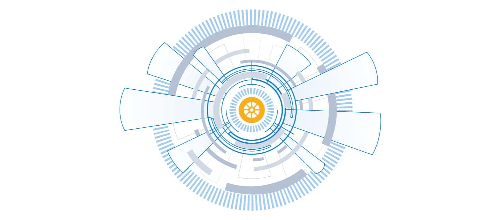

# Frameworks

Frameworks are often used to establish a good security posture, align to common organisational defensive strategies, and set up for 
continuous improvement.

## Lifecycle

|                                                        |
|:-----------------------------------------------------------------------------------------------------------------------:|
| Credits: [Introduction to Cyber Threat Intelligence (CTI)](https://hackersterminal.com/cyber-threat-intelligence-cti/). |

Threat intel is obtained from a data-churning process that transforms raw data into contextualised and action-oriented 
insights geared towards triaging security incidents. The transformational process can be expressed in a six-phase 
cycle:

### Direction

Every threat intel program requires to have objectives and goals defined, involving identifying the parameters:

* Information assets and business processes that require defending.
* Potential impact to be experienced on losing the assets or through process interruptions.
* Sources of data and intel to be used towards protection.
* Tools and resources that are required to defend the assets.

This phase also allows security analysts to pose questions related to investigating incidents.

### Collection

Once objectives have been defined, security analysts will gather the required data to address them. Analysts will do 
this by using commercial, private and open-source resources available. Due to the volume of data analysts usually face, 
it is recommended to automate this phase to provide time for triaging incidents.

### Processing

Raw logs, vulnerability information, malware and network traffic usually come in different formats and may be 
disconnected when used to investigate an incident. This phase ensures that the data is extracted, sorted, organised, 
correlated with appropriate tags and presented visually in a usable and understandable format to the analysts. 
SIEMs are valuable tools for achieving this and allow quick parsing of data.

### Analysis

Once the information aggregation is complete, security analysts must derive insights. Decisions to be made may involve:

* Investigating a potential threat through uncovering indicators and attack patterns.
* Defining an action plan to avert an attack and defend the infrastructure.
* Strengthening security controls or justifying investment for additional resources.

### Dissemination

Different organisational stakeholders will consume the intelligence in varying languages and formats. For example, 
C-suite members will require a concise report covering trends in adversary activities, financial implications and 
strategic recommendations. At the same time, analysts will more likely inform the technical team about the threat 
IOCs, adversary TTPs and tactical action plans.

### Feedback

The final phase covers the most crucial part, as analysts rely on the responses provided by stakeholders to improve 
the threat intelligence process and implementation of security controls. Feedback should be regular interaction 
between teams to keep the lifecycle working.

## Pyramid of pain

|                                                                                                                                                                |
|:--------------------------------------------------------------------------------------------------------------------------------------------------------------------------------------------------------------:|
| The Pyramid of Pain is a conceptual model for the effective use of Cyber Threat Intelligence in threat  detection operations, with a particular emphasis on increasing the adversaries' cost of operations. |

###  Hash Values

Most hash algorithms compute a message digest of the entire input, and output a fixed length hash that is unique to 
the given input.  If the contents of two files varies even by a single bit, the resultant hash values of the two 
files are different.

It is really easy to spot a malicious file if we have the hash in our arsenal. But as an attacker, it is trivial to 
modify a file by even a single bit, which would produce a different hash value. With so many variations and instances 
of known malware or ransomware, threat hunting using file hashes as the IOC (Indicators of Compromise) can become a 
difficult task.

Fuzzy hashes attempt to solve this problem by computing hash values that take into account similarities in the input. 
Two files with only minor or moderate differences would have fuzzy hash values that are similar, allowing an 
investigator to note a possible relationship between them.

###  IP Addresses

The most fundamental indicator. Short of data copied from local hard drive and leaving the front door on a USB key, 
you pretty much have to have an network connection of some sort in order to carry out an attack, and a connection 
means IP Addresses. And there are many. 

A common defense tactic is to block, drop, or deny inbound requests from IP addresses on your parameter or external 
firewall. This tactic is often not bulletproof as it is trivial for an experienced adversary to recover simply by 
using a new public IP address. 

If they are using Fast Flux, or an anonymous proxy service like Tor or something similar, they may 
change IP address quite frequently and never even notice or care.

### Domain Names

Domain names are slightly more of a pain to change, because in order to work, they must be registered, paid for 
(even if with stolen funds) and hosted somewhere.  That said, there are a large number of DNS providers with 
not too impressive registration standards (even for free), so in practice it's not too hard to change domains.  

New domains may take anywhere up to a day or two to be visible throughout the Internet, so these are slightly 
harder to change than just IP addresses.

### Network & Host Artifacts

On the Network and Host Artifacts level, the attacker will likely feel a little more annoyed and frustrated if 
you can detect the attack. The attacker would need to circle back at this detection level and change his 
attack tools and methodologies. This is very time-consuming for the attacker, and probably, he will need to 
spend more resources on his adversary tools.

Host artifacts are the traces or observables that attackers leave on the system, such as registry values, 
suspicious process execution, attack patterns or IOCs (Indicators of Compromise), files dropped by malicious 
applications, or anything exclusive to the current threat.

A network artifact can be a user-agent string, C2 information, or URI patterns followed by the HTTP POST requests. 
An attacker might use a `User-Agent` string that has not been observed in your environment before or seems out of the 
ordinary.

### Tools

At the Tools level, we are trying to impede the adversary's ability to use one or more specific arrows in their quiver. 
Most likely this happens because we just got so good at detecting the artifacts of their tool in different ways, that 
they give up or have to find or create a new tool for the same purpose. This is a big win, because now they have to 
invest time in research (find an existing tool that has the same capabilities), development (create a new tool if 
they are able) and training (figure out how to use the tool and become proficient with it). You just cost them some 
real time, especially if you are able to do this across several of their tools.

Some examples of tool indicators might include AV or Yara signatures, if they are able to find variations of the 
same files even with moderate changes. Network aware tools with a distinctive communication protocol may also fit 
at this level, where changing the protocol would require substantial rewrites to the original tool. And fuzzy hashes. 

### Tactics, Techniques & Procedures

At the apex of the pyramid are the TTPs. Detecting and responding at this level means operating against adversary 
behaviours, not against their tools.  

If you can detect and respond to the TTPs quickly, you leave the adversaries almost no chance to fight back. For 
example, if you could detect a Pass-the-Hash attack using Windows Event Log Monitoring and remediate it, you would 
be able to find the compromised host very quickly and stop the lateral movement inside your network.

From an effectiveness standpoint, this level is ideal. If you are able to respond to adversary TTPs quickly enough, 
you force them to do the most time-consuming thing possible: learn new behaviours. Or give up.

## Cyber kill chain

|  |
|:--:|
| The Cyber Kill Chain framework is designed for identification and prevention of the network intrusions. |

Lockheed Martin established the Cyber Kill Chain® framework for the cybersecurity industry in 2011 based on the 
military concept. The framework defines the steps used by adversaries or malicious actors in cyberspace.

The cyber kill chain is not outdated. Instead, it has security gaps. And that is akin to "not a bug, a feature". 
These security gaps exist because the model has not been modified since its creation about a decade ago. The model’s 
design works well to protect against malware prevention and detection, which it was designed for. The model's problem 
stems from the fact that it uses an ancient approach to network security, focusing only on malware prevention and 
perimeter security.

* The different stages of the protocol controls does nothing to detect an attacks' progression.
* The model cannot identify insider threats or intrusions with remote access, because these threats do not involve malware or payloads.

### Reconnaissance

A malicious attacker who names himself "Megatron" decides to conduct a very sophisticated attack that he has been 
planning out for years; he has been studying and researching different tools and techniques that could help him get 
to the last phase of the Cyber Kill Chain. But first, he needs to start from the Reconnaissance phase. 

During reconnaissance, attackers gather as much info they can access about their targets. The attackers can use a 
wide range of tools. In most cases, they take advantage of the public information available about their targets and 
continue from there. 

Examples of this stage of attack include: 

* Attackers can use automated scanners to find weak points and vulnerabilities that allow penetration. 
* Attackers also investigate the victim’s security systems, like intrusion detection systems, authentication mechanisms, and firewalls. 
* Attackers would also use social media websites such as LinkedIn, Facebook, Twitter, and Instagram to collect 
information on a specific victim he would want to attack or the company. The information found on social media can 
be beneficial for an attacker to conduct a phishing attack.

### Weaponisation

At this stage of the attack, the attackers act on the information they have collected about their target and 
find weaknesses they can exploit. Using the exploit, the attackers will create a malicious payload using encrypted 
channels such as HTTPS port 443 over SSL that they will send to their victim. Everything is still on the attacker’s 
side, and the target has not been exploited or actively attacked yet.

"Megatron" chooses to buy an already written payload from someone else in the DarkWeb, so that he can spend more 
time on the other phases. 

In the Weaponisation phase, the attacker would:

* Create an infected Microsoft Office document containing a malicious macro or VBA (Visual Basic for Applications) scripts. If you want to learn about macro and VBA, please refer to the article "Intro to Macros and VBA For Script Kiddies" by TrustedSec.
* Attackers can create a malicious payload or a very sophisticated worm, implant it on the USB drives, and then distribute them in public. An example of the virus. 
* Attackers would choose Command and Control (C2) techniques for executing the commands on the victim's machine or deliver more payloads. You can read more about the C2 techniques on MITRE ATT&CK.
* Attackers would select a backdoor implant (the way to access the computer system, which includes bypassing the security mechanisms).

### Delivery

At the intrusion stage, the attacker is trying to gain entry into the victim’s security perimeter. To do this, attackers usually inject various forms of malware into the systems of the victim to gain control. The malicious content can be delivered to the target either by social engineering email, social media or compromised systems or accounts or a security breach like an open port or an insider accomplice. 

"Megatron" decides to choose the method for transmitting the payload or the malware. He has plenty of options to choose from: 

* Phishing email
* Distributing infected USB drives in public places like coffee shops, parking lots, or on the street. 
* Watering hole attack
* Supply chain compromise
* Spear phishing attachments
* External/remote services

### Exploitation

During the exploitation stage, attackers will seek other victim vulnerabilities that they did not know before entering. For instance, an attacker might not have privileged access to an organisation’s database from outside; however, they might spot vulnerabilities in the database that allows them to gain entry after an intrusion. 

Example attacks in the exploitation stage include:

* PowerShell, .Net, C# scripts
* Local job scheduling
* Dynamic data exchange

"Megatron" got a bit creative - he created two phishing emails, one that contains a phishing link to a fake Office 365 login page and another one containing a macro attachment that would execute ransomware when the victim opens it. "Megatron" successfully delivered his exploits and got two victims to click on the malicious link and open the malicious file.

### Installation

At the privilege escalation stage, the attacker attempts to gain the additional privilege to more accounts and 
systems. The attacker might decide to use brute force, or on the alternative, he might seek out unprotected 
repositories containing security credentials or monitor networks without encryption to track the credentials. 
He might as well consider changing permissions on previously existing compromised accounts.

He would want to reaccess the system if he loses the connection to it 
or if he got detected and got the initial access removed, or if the system is later patched. He will no longer 
have access to it. That is when the attacker needs to install a persistent backdoor. A persistent backdoor will 
let the attacker access the system he compromised in the past.

When he has the persistence and credentials he needs, the attacker then proceeds to other systems to find the most 
valuable assets of his target. Attackers typically move from one system to the other, seeking access to privileged accounts, 
sensitive data. This is usually a coordinated attack and usually affects several user accounts and IT systems.  

Example attacks in the privilege escalation and lateral movement stage:

* Windows remote management
* Pseudo attack
* SSH hijacking
* Shared webroot
* Process injection
* Path interception
* Internal spear phishing
* Access token manipulation

Persistence can be achieved through:

* Installing a web shell on the webserver. A web shell is a malicious script written in web development programming languages such as ASP, PHP, or JSP used by an attacker to maintain access to the compromised system. Because of the web shell simplicity and file formatting (.php, .asp, .aspx, .jsp, etc.) can be difficult to detect and might be classified as benign. You may check out this great article released by Microsoft on various web shell attacks.
* Installing a backdoor on the victim's machine. For example, the attacker can use Meterpreter to install a backdoor on the victim's machine. Meterpreter is a Metasploit Framework payload that gives an interactive shell from which an attacker can interact with the victim's machine remotely and execute the malicious code.
* Creating or modifying Windows services. This technique is known as T1543.003 on MITRE ATT&CK (MITRE ATT&CK® is a knowledge base of adversary tactics and techniques based on real-world scenarios). An attacker can create or modify the Windows services to execute the malicious scripts or payloads regularly as a part of the persistence. An attacker can use the tools like sc.exe (sc.exe lets you Create, Start, Stop, Query, or Delete any Windows Service) and Reg to modify service configurations. The attacker can also masquerade the malicious payload by using a service name that is known to be related to the Operating System or legitimate software. 
* Adding the entry to the "run keys" for the malicious payload in the Registry or the Startup Folder. By doing that, the payload will execute each time the user logs in on the computer. According to MITRE ATT&CK, there is a startup folder location for individual user accounts and a system-wide startup folder that will be checked no matter what user account logs in.

### Command & Control

After getting persistence and executing the malware on the victim's machine, "Megatron" opens up the C2 (Command and Control) channel through the malware to remotely control and manipulate the victim. This term is also known as C&C or C2 Beaconing as a type of malicious communication between a C&C server and malware on the infected host. The infected host will consistently communicate with the C2 server; that is also where the beaconing term came from. 

Now that the attacker has gained control of a significant part of the victim’s systems and user accounts and 
privileged, he will now develop a command control channel to operate and monitor his attack remotely. This stage 
will involve obfuscation and denial of service. Obfuscation is when the attacker tries to cover his tracks, 
making it look like nothing has happened. 

Examples of activities in the obfuscation stage include:

* Binary padding
* Code signing
* File deletion
* Hidden users
* Process hollowing

After obfuscation, denial of service will then take place, which is the opposite of obfuscation. The attacker 
who has been keeping a low profile will not decide to cause issues in the systems to announce their presence. 
This is usually to distract the attention of the security teams, so he can perpetuate his fundamental objectives. 
The following are examples of attacks at the Denial-of-Service stage:

* System shutdown
* Service stop
* Resource hijacking
* Network denial of service
* Endpoint denial of service

### Actions on Objectives

Every form of cyberattack has an underlying objective. The attacker usually has some objective in the victim’s network, data exfiltration, data deletion or supply chain attacks. At this stage, he brings together all the activities that will help achieve these goals. This step might involve weeks to months.  

After going through six phases of the attack, "Megatron" can finally achieve his goals, which means taking action on the original objectives. 

With hands-on keyboard access, attackers can achieve the following: 

* Collect more credentials from users.
* Perform more privilege escalation (gaining elevated access like domain administrator access from a workstation by exploiting a misconfiguration).
* Internal reconnaissance (for example, an attacker gets to interact with internal software to find its vulnerabilities).
* Continued lateral movement through the organisation's environment.
* Collect and exfiltrate sensitive data (over alternative protocol or over a physical medium).
* Deleting backups and shadow copies. 
* Overwrite or corrupt data.

## MITRE ATT&CK kill chain

|  |
|:--:|
| The MITRE ATT&CK™ framework is a constantly evolving hub of attacker tips, tactics, and  techniques used by IT and security teams to pinpoint their organisation’s risks and  prioritize and focus their protection efforts. |

ATT&CK is an acronym that stands for Adversarial Tactics, Techniques, and Common Knowledge. This framework is a 
combination of intrusion techniques grouped into 12 different tactics.

### Initial access

These are techniques used by various entry vectors to gain an initial foothold within a network, for instance, the T1192 Spear Phishing Link.

### Execution

These are techniques that allow the running of attacker-controlled code on a local system or a remote one. An example is the T1086 PowerShell  

### Persistence

These are techniques attackers use to maintain persistence when accessing a system. An example is the T1037 Logon Script.

### Privilege escalation

These are techniques that allow attackers to gain high-level privileges on a system or network. An example is the T1055 Process Injection.

### Defence evasion

These are techniques attackers use in avoiding detection. An example is the T1073 DLL Side-Loading. 

### Credential access

These are techniques attackers use for stealing credentials like account names, passwords. An example is the T1208 Kerberoasting

### Discovery

These are the techniques attackers use to gain knowledge about their clients’ systems and networks. An example is the T1040 Network Sniffing

### Lateral movement

These are techniques that attackers use in gaining remote access to the systems and networks of their already compromised host. Usually, attackers move through multiple computers, starting with the weakest link till they reach their aim. An example is a T1097 Pass the Ticket

### Collection

These are the techniques that aid in gathering information relevant to the attacker’s aim. An example is the T1506 input capture.  These are techniques attackers employ to communicate with the systems they have under their control, often making things look like regular HTTP traffic. An example is the T1172 Domain Fronting. 

### Exfiltration

These are techniques that attackers use to steal data from the network of their victims. An example is the T1002 Data Compressed. 

### Impact

These are techniques used by attackers to disturb or compromise networks’ integrity by manipulating operational and business processes. The impact is the last phase, and it is what happens when the attacker has reached their goal.

## Unified kill chain

| 
|:--:|
| Unified kill chain: In, through, out. |

A more comprehensive approach combines elements from both the Cyber kill chain and the MITRE ATT&CK kill chain, dividing an attack into 18 stages: Everything from reconnaissance to data exfiltration and understanding an attacker's motive. 
 
By using these two frameworks and comparing IOCs simultaneously against several feeds of reliable threat intel, it helps to know whether a threat needs attention or not. Both defenders and red teams can use a unified kill chain attack model to help develop and improve defensive controls.

## Diamond model

The diamond model of intrusion analysis is an approach to authenticate and track cyber threats. In this approach, every incident is depicted as a diamond. The methodology underlines the relationships and characteristics of four components of the diamond: adversary, capability, infrastructure, and victim. These four core elements are connected in relationship between each other which can then be analytically examined to further uncover insights and gain knowledge of malicious activities. 

| 
|:--:|
| Empire’s capabilities and infrastructure, as well as the dependencies or tactics that enable them. |

The diamond model of intrusion analysis illustrates that an `adversary` uses a `capability` over an `infrastructure` against a `victim`.

### Adversary

An adversary is an organisation or threat actor responsible for leveraging a capability against a victim to fulfill its goals. The adversary is the person who stands behind the cyberattack. 

The distinction between adversary operator and adversary makes intent, attribution, adaptability, and persistence clear by helping to frame the relationship between an adversary and victim pair.  

It is difficult to identify an adversary during the first stages of a cyberattack. Using data collected from an incident or breach, signatures, and other relevant information can help determine who the adversary might be.

* Adversary Operator is the hacker or person(s) conducting the intrusion activity.
* Adversary Customer is the entity that stands to benefit from the activity in the intrusion. It may be the same person who stands behind the adversary operator, or it may be a separate person or group. An adversary customer could control different operators simultaneously. Each operator might have its capabilities and infrastructure.

### Capability

The capabilities refer to the tools and techniques used by an adversary in an event. It highlights the adversary's tactics, techniques, and procedures (TTPs) and includes all techniques used to attack the victims, from the less sophisticated methods, such as manual password guessing, to the most sophisticated techniques, like developing malware or a malicious tool. 

* Capability Capacity is all the vulnerabilities and exposures that the individual capability can use. 
* An Adversary Arsenal is a set of capabilities that belong to an adversary. The combined capacities of an adversary's capabilities make it the adversary's arsenal.

An adversary must have the required capabilities. The capabilities can be malware and phishing email development skills or, at least, access to capabilities, such as acquiring malware or ransomware as a service.

### Infrastructure

The infrastructure includes the physical or logical communication structures such as IP or e-mail addresses, domain names, and others, employed by an adversary to deliver a capability. 

* Type 1 Infrastructure is the infrastructure controlled or owned by the adversary. 
* Type 2 Infrastructure is the infrastructure controlled by an intermediary. Sometimes the intermediary might or might not be aware of it. This is the infrastructure that a victim will see as the adversary. Type 2 Infrastructure has the purpose of obfuscating the source and attribution of the activity. Type 2 Infrastructure includes malware staging servers, malicious domain names, compromised email accounts, etc.
* Service Providers are organisations that provide services considered critical for the adversary availability of Type 1 and Type 2 Infrastructures, for example, Internet Service Providers, domain registrars, and webmail providers.

### Victim

A victim is a target against whom attacks are initiated, vulnerabilities are exploited, or capabilities are used. 
It can be organisations, people, or assets, such as target email or IP addresses, domains, and so on. 

There is always a victim in every cyberattack. For example, the spear-phishing email (a well-crafted email targeting a specific person of interest) was sent to the company, and someone (victim) clicked on the link. In this case, the victim is the selected target of interest for an adversary. 

* Victim Personae are the people and organisations being targeted and whose assets are being attacked and exploited. These can be organisation names, people’s names, industries, job roles, interests, etc.
* Victim Assets are the attack surface and include the set of systems, networks, email addresses, hosts, IP addresses, social networking accounts, etc., to which the adversary will direct their capabilities.

### Centered approaches

The model focuses on several trade-craft concepts of intrusion analysis which are referred to as ‘centered’ approaches. These approaches are centered on a certain feature of the diamond model to detect new malicious activities and expose activities related to the other relevant features. There are six centered approaches: adversary-centered, capability-centered, infrastructure-centered, victim-centered, social-political-centered, and technology centered. The first four focus on the diamond nodes while the remaining two focus on the meta-features of the diamond.

### Meta features

Meta-features are not required, but they can add some valuable information or intelligence to the Diamond Model.

* Timestamp - is the date and time of the event. Each event can be recorded with a date and time that it occurred, such as 2021-09-12 02:10:12.136. The timestamp can include when the event started and stopped. Timestamps are essential to help determine the patterns and group the malicious activity. For example, if the intrusion or breach happened at 3 am in the United States, it might be possible that the attack was carried out from a specific country with a different time zone and standard business hours. 
* Phase - these are the phases of an intrusion, attack, or breach. An example can be the Cyber Kill Chain (CKC) developed by Lockheed Martin. For example, an attacker needs to do some research to discover the target or a victim. Then they would try to exploit the target, establish a command-and-control centre and, lastly, exfiltrate the sensitive information. 
* Result - While the results and post-conditions of an adversary’s operations will not always be known or have a high confidence value when they are known, they are helpful to capture. The event results can be labelled as "success," "failure," or "unknown." The event results can also be related to the CIA (confidentiality, integrity, and availability) triad, such as Confidentiality Compromised, Integrity Compromised, and Availability Compromised. Another approach can also be documenting all the post-conditions resulting from the event, for example, information gathered in the reconnaissance stage or successful passwords/sensitive data exfiltration.
* Direction - This meta-feature helps describe host-based and network-based events and represents the direction of the intrusion attack. The Diamond Model of Intrusion Analysis defines seven potential values for this meta-feature: Victim-to-Infrastructure, Infrastructure-to-Victim, Infrastructure-to-Infrastructure, Adversary-to-Infrastructure, Infrastructure-to-Adversary, Bidirectional or Unknown.
* Methodology - This meta-feature will allow an analyst to describe the general classification of intrusion, for example, phishing, DDoS, breach, port scan, etc. 
* Resources - According to the Diamond Model, every intrusion event needs one or more external resources to be satisfied to succeed. Examples of the resources can include the following: software (e.g., operating systems, virtualisation software, or Metasploit framework), knowledge (e.g., how to use Metasploit to execute the attack and run the exploit), information (e.g., a username/password to masquerade), hardware (e.g., servers, workstations, routers), funds (e.g., money to purchase domains), facilities (e.g., electricity or shelter), access (e.g., a network path from the source host to the victim and vice versa, network access from an Internet Service Provider (ISP)).

### Social political

The social-political component describes the needs and intent of the adversary, for example, financial gain, gaining acceptance in the hacker community, hacktivism, espionage, ... 

The scenario can be that the victim provides a “product”, for example, computing resources & bandwidth as a zombie in a botnet for crypto mining (producing new cryptocurrencies by solving cryptographic equations through the use of computers) purposes, while the adversary consumes their product or gets financial gain. 

### Technology

Technology – the technology meta-feature or component highlights the relationship between the core features: capability and infrastructure. The capability and infrastructure describe how the adversary operates and communicates. 
A scenario can be a watering-hole attack which is a methodology where the adversary compromises legitimate websites that they believe their targeted victims will visit.

|     |
|:---------------------------------------------------------------------------------:|
| A more realistic, general Diamond Model summarizing a cyber adversary’s activity. |

## Resources

* [Persistent Backdoors](https://www.offensive-security.com/metasploit-unleashed/persistent-backdoors/)
* [The Pyramid of Pain](https://detect-respond.blogspot.com/2013/03/the-pyramid-of-pain.html)
* [The Unified Kill Chain](https://unifiedkillchain.com/)
* [Metadefender Cloud - OPSWAT](https://metadefender.opswat.com/)
* [SSDeep](https://ssdeep-project.github.io/ssdeep/index.html)
* [Fast Flux 101: How Cybercriminals Improve the Resilience of Their Infrastructure to Evade Detection and Law Enforcement Takedowns](https://unit42.paloaltonetworks.com/fast-flux-101/)
* [What is the Diamond Model of Intrusion Analysis?](https://cyware.com/educational-guides/cyber-threat-intelligence/what-is-the-diamond-model-of-intrusion-analysis-5f02/)
* [A Security Professional’s Guide to the Diamond Model](https://mcsi-library.readthedocs.io/articles/2022/07/a-security-professional-s-guide-to-the-diamond-model/a-security-professional-s-guide-to-the-diamond-model.html)
* [Threat connect: Threat Research](https://threatconnect.com/blog/category/threat-research/)

