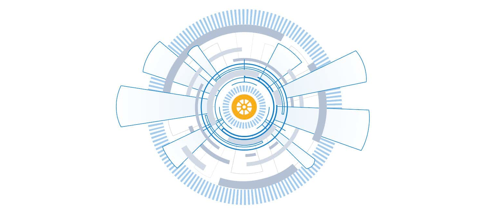

# MITRE ATT&CK framework

|  |
|:--:|
| The MITRE ATT&CK™ framework is a constantly evolving hub of attacker tips, tactics, and  techniques used by IT and security teams to pinpoint their organisation’s risks and  prioritize and focus their protection efforts. |

ATT&CK is an acronym that stands for Adversarial Tactics, Techniques, and Common Knowledge. This framework is a 
combination of intrusion techniques grouped into 12 different tactics.

## Initial access

These are techniques used by various entry vectors to gain an initial foothold within a network, for instance, the T1192 Spear Phishing Link.

## Execution

These are techniques that allow the running of attacker-controlled code on a local system or a remote one. An example is the T1086 PowerShell  

## Persistence

These are techniques attackers use to maintain persistence when accessing a system. An example is the T1037 Logon Script.

## Privilege escalation

These are techniques that allow attackers to gain high-level privileges on a system or network. An example is the T1055 Process Injection.

## Defence evasion

These are techniques attackers use in avoiding detection. An example is the T1073 DLL Side-Loading. 

## Credential access

These are techniques attackers use for stealing credentials like account names, passwords. An example is the T1208 Kerberoasting

## Discovery

These are the techniques attackers use to gain knowledge about their clients’ systems and networks. An example is the T1040 Network Sniffing

## Lateral movement

These are techniques that attackers use in gaining remote access to the systems and networks of their already compromised host. Usually, attackers move through multiple computers, starting with the weakest link till they reach their aim. An example is a T1097 Pass the Ticket

## Collection

These are the techniques that aid in gathering information relevant to the attacker’s aim. An example is the T1506 input capture.  These are techniques attackers employ to communicate with the systems they have under their control, often making things look like regular HTTP traffic. An example is the T1172 Domain Fronting. 

## Exfiltration

These are techniques that attackers use to steal data from the network of their victims. An example is the T1002 Data Compressed. 

## Impact

These are techniques used by attackers to disturb or compromise networks’ integrity by manipulating operational and business processes. The impact is the last phase, and it is what happens when the attacker has reached their goal.

## Resources

* [MITRE ATT&CK®](https://attack.mitre.org/)
* [Cyber Kill Chain, MITRE ATT&CK, and Purple Team](https://www.sans.org/blog/cyber-kill-chain-mitre-attack-purple-team/)
