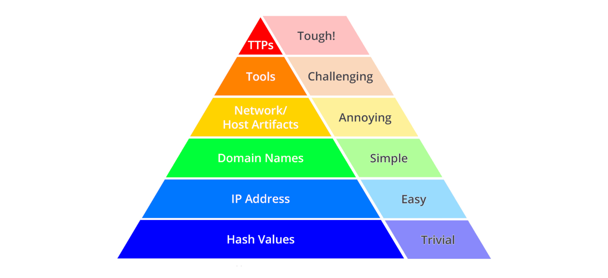

# Pyramid of pain

|                                                                                                                                                                |
|:--------------------------------------------------------------------------------------------------------------------------------------------------------------------------------------------------------------:|
| The Pyramid of Pain is a conceptual model for the effective use of Cyber Threat Intelligence in threat  detection operations, with a particular emphasis on increasing the adversaries' cost of operations. |

##  Hash Values

Most hash algorithms compute a message digest of the entire input, and output a fixed length hash that is unique to 
the given input.  If the contents of two files varies even by a single bit, the resultant hash values of the two 
files are different.

It is really easy to spot a malicious file if we have the hash in our arsenal. But as an attacker, it is trivial to 
modify a file by even a single bit, which would produce a different hash value. With so many variations and instances 
of known malware or ransomware, threat hunting using file hashes as the IOC (Indicators of Compromise) can become a 
difficult task.

Fuzzy hashes attempt to solve this problem by computing hash values that take into account similarities in the input. 
Two files with only minor or moderate differences would have fuzzy hash values that are similar, allowing an 
investigator to note a possible relationship between them.

##  IP Addresses

The most fundamental indicator. Short of data copied from local hard drive and leaving the front door on a USB key, 
you pretty much have to have an network connection of some sort in order to carry out an attack, and a connection 
means IP Addresses. And there are many. 

A common defense tactic is to block, drop, or deny inbound requests from IP addresses on your parameter or external 
firewall. This tactic is often not bulletproof as it is trivial for an experienced adversary to recover simply by 
using a new public IP address. 

If they are using Fast Flux, or an anonymous proxy service like Tor or something similar, they may 
change IP address quite frequently and never even notice or care.

## Domain Names

Domain names are slightly more of a pain to change, because in order to work, they must be registered, paid for 
(even if with stolen funds) and hosted somewhere.  That said, there are a large number of DNS providers with 
not too impressive registration standards (even for free), so in practice it's not too hard to change domains.  

New domains may take anywhere up to a day or two to be visible throughout the Internet, so these are slightly 
harder to change than just IP addresses.

## Network & Host Artifacts

On the Network and Host Artifacts level, the attacker will likely feel a little more annoyed and frustrated if 
you can detect the attack. The attacker would need to circle back at this detection level and change his 
attack tools and methodologies. This is very time-consuming for the attacker, and probably, he will need to 
spend more resources on his adversary tools.

Host artifacts are the traces or observables that attackers leave on the system, such as registry values, 
suspicious process execution, attack patterns or IOCs (Indicators of Compromise), files dropped by malicious 
applications, or anything exclusive to the current threat.

A network artifact can be a user-agent string, C2 information, or URI patterns followed by the HTTP POST requests. 
An attacker might use a `User-Agent` string that has not been observed in your environment before or seems out of the 
ordinary.

## Tools

At the Tools level, we are trying to impede the adversary's ability to use one or more specific arrows in their quiver. 
Most likely this happens because we just got so good at detecting the artifacts of their tool in different ways, that 
they give up or have to find or create a new tool for the same purpose. This is a big win, because now they have to 
invest time in research (find an existing tool that has the same capabilities), development (create a new tool if 
they are able) and training (figure out how to use the tool and become proficient with it). You just cost them some 
real time, especially if you are able to do this across several of their tools.

Some examples of tool indicators might include AV or Yara signatures, if they are able to find variations of the 
same files even with moderate changes. Network aware tools with a distinctive communication protocol may also fit 
at this level, where changing the protocol would require substantial rewrites to the original tool. And fuzzy hashes. 

## Tactics, Techniques & Procedures

At the apex of the pyramid are the TTPs. Detecting and responding at this level means operating against adversary 
behaviours, not against their tools.  

If you can detect and respond to the TTPs quickly, you leave the adversaries almost no chance to fight back. For 
example, if you could detect a Pass-the-Hash attack using Windows Event Log Monitoring and remediate it, you would 
be able to find the compromised host very quickly and stop the lateral movement inside your network.

From an effectiveness standpoint, this level is ideal. If you are able to respond to adversary TTPs quickly enough, 
you force them to do the most time-consuming thing possible: learn new behaviours. Or give up.

## Resources

* [The Pyramid of Pain](https://detect-respond.blogspot.com/2013/03/the-pyramid-of-pain.html)
