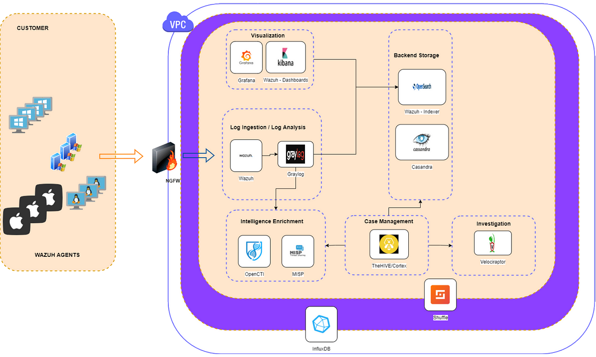

# SIEM stack

Security information and event management (SIEM) is an approach to security management that combines security information management (SIM) and security event management (SEM) functions into one security management system.

It is a software solution that aggregates and analyses activity from many different resources across an IT infrastructure. SIEM collects security data from network devices, servers, domain controllers, etc., and search queries can be done to look for specific answers from ingested logs. 

## Tools and architecture

Many SIEM tools exist, Kibana, Splunk, Elastic SIEM, Datadog, QRadar, UnderDefense, etc., and architecture varies. In general, if a tool has a SIEM engine, it contains three components:

* A data collector forwarding selected audit logs from a host (agent based or host based log streaming into index and aggregation point)
* An aggregation point for parsing, correlation, and data normalisation.
* A search node used for visualisation, queries, reports, and alerts (actual analysis takes place on a search node)

## SIEM stack requirements

### Log ingestion

* Collect logs originating on endpoint devices, network devices, or 3rd party services
* Normalise log fields to universal names for faster searching and better visualisations
* Ensure caching of logs if backend storage is busy or offline

### Log analysis

* Analyse logs from endpoints/services
* Determine the severity of logs ingested via log analysis
* Ability to discard noisy alerts to limit overflow of unnecessary data

### Backend storage

* Store received logs for a period of time
* Fast searching and viewing of data
* Ability to provide access control to stored logs

### Visualisation

* Ability to view logs via widgets
* Fast searching and viewing of data
* Support the ability to read from multiple log storages (Elastic, MySQL, ...)

### Intelligence enrichment

* Enrich received log with threat intelligence gathered from various providers
* Ability to parse and store selected responses so that only crucial data is stored
* Automated, so that SOC analysts are not having to manually attempt to enrich logs

### Case management

* Platform to view and react to high severity events
* Allow collaboration with multiple SOC analysts
* Allow responsive actions so that analysts can trigger events on their endpoints (escalation procedure)

### Automate

* SOAR platform
* Ability to automate workflows in response to critical alerts, failed health checks, or ticket analysis
* Fully customisable, and fast

### Investigation

* Incident response
* Quarantine a device
* Ability to remotely collect endpoint forensics

### Health monitoring

* Monitor resources consumed on endpoints
* Monitor services/process whose stoppage would cause operational impact
* Ability to alert in real-time when health check thresholds are met

## Testlab

Gradually building up to something useful for the IPA project:

* [Wazuh single-node stack with docker](https://testlab.tymyrddin.dev/docs/siem/wazuh-single-node), bare-bones single-node deployment: One Wazuh manager, indexer, and dashboard node.

## Testlab

* [SIEM stack](https://testlab.tymyrddin.dev/docs/siem/readme) All tools in these stacks are open source and free. 
