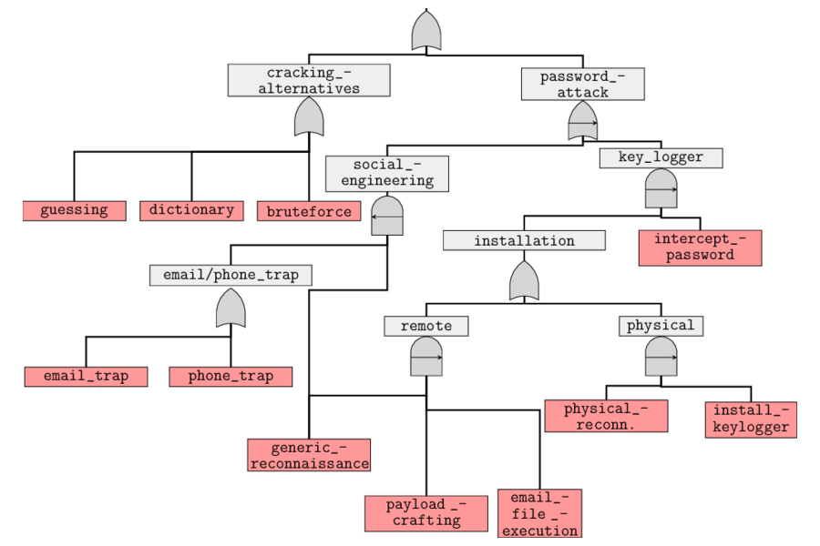

# Standards

Standardisation of communication on evidence-based information includes:

* Mechanisms of an attack
* How to detect an attack
* Impact of different types of attacks
* Action-oriented advice about how to defend against attacks

Purpose is to achieve consistently high levels of:

* Clarity
* Measurability
* Quality
* Repeatability & error susceptibility
* Portability & transferability
* Automation
* Productivity

## TAXII

The [Trusted Automated eXchange of Indicator Information (TAXII)](https://oasis-open.github.io/cti-documentation/taxii/intro) 
defines protocols for securely exchanging threat Intel to have near real-time detection, prevention and mitigation of 
threats. The protocol supports two sharing models:

* Collection: Threat intel is collected and hosted by a producer upon request by users using a request-response model.
* Channel: Threat intel is pushed to users from a central server through a publish-subscribe model.

## STIX

[Structured Threat Information Expression (STIX)](https://oasis-open.github.io/cti-documentation/stix/intro) is a 
language developed for the "specification, capture, characterisation and communication of standardised cyber threat 
information". It provides defined relationships between sets of threat info such as observables, indicators, adversary 
TTPs, attack campaigns, and more.

## Attack trees

Attack trees are conceptual diagrams showing how an asset, or target, might be attacked. These are multi-level 
diagrams consisting of one root node, leaves, and children nodes. Bottom to Top, child nodes are conditions that must 
be satisfied to make the direct parent node true. An attack is considered complete when the root is satisfied. 
Each node may be satisfied only by its direct child nodes. 

|  |
|:-------------------------------------------------------------------------:|
|                Attack on a password. Credit: Rajesh Kumar                 |

Suppose there is 1 grandchild below the root node. In such a case multiple steps must be taken to carry out an attack 
as first the grandchild’s conditions must be satisfied for the direct parent node to be true and then the direct parent 
node condition must be satisfied to make the root node true. It also has `AND` and `OR` options which represent 
alternatives and different steps towards achieving that goal.

Commercial tools like SecurITree, AttackTree+ and opensource tools like ADTool, Ent, and SeaMonster can be used to model 
attack trees. And since this is just about drawing boxes, a simple drawing tool will also do. Writing out the tree 
in lists is another very common option and can suffice. 
