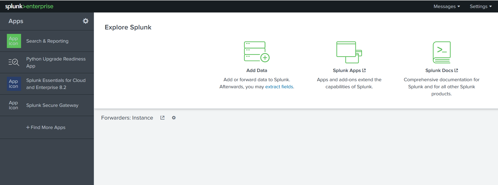

# Navigation

## Splunk Bar

When you access Splunk, you will see the default home screen:

| 
|:--:|
| The top panel is the Splunk Bar |

In the Splunk Bar, you can see system-level messages (Messages), configure the Splunk instance (Settings), review 
the progress of jobs (Activity), miscellaneous information such as tutorials (Help), and a search feature (Find).  

## Apps Panel

In this panel, you can see the apps installed for the Splunk instance. The default app for every Splunk installation 
is Search & Reporting. 

## Explore Splunk

The next section is Explore Splunk. This panel contains quick links to add data to the Splunk instance, add new 
Splunk apps, and access the Splunk documentation. 

## Splunk Dashboard

The last section is the Home Dashboard. By default, no dashboards are displayed. You can choose from a range of 
dashboards readily available within your Splunk instance. You can select a dashboard from the dropdown menu or by 
visiting the dashboards listing page.

You can also create dashboards and add them to the Home Dashboard. The dashboards you create can be viewed isolated 
from the other dashboards by clicking on the `Yours` tab.
