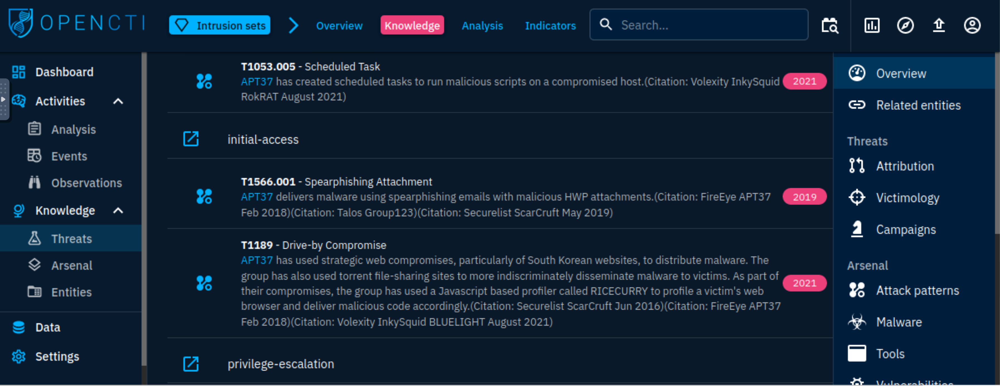

# CaddyWiper and APT37

As a SOC analyst, you have been tasked with investigations on malware and APT groups rampaging through the world. 
Your assignment is to look into the CaddyWiper malware and APT37 group. Gather information from OpenCTI to answer 
the following questions.

***What is the earliest date recorded related to CaddyWiper?  Format: YYYY/MM/DD***

|  |
|:---------------------------------------------------------------------------:|
|             2022/03/15 (Search for and read the report online)              |

***Which Attack technique is used by the malware for execution?***

|  |
|:-------------------------------------------------------------------------------:|
|                                   Native API                                    |

***How many malware relations are linked to this Attack technique?***

|  |
|:--------------------------------------------------------------------------------:|
|                                       113                                        |

***Which 3 tools were used by the Attack Technique in 2016? (Ans: Tool1, Tool2, Tool3)***

|  |
|:-------------------------------------------------------------------------:|
|                    Bloodhound, Empire, ShimRatReporter                    |

***What country is APT37 associated with?***

|  |
|:----------------------------------------------------------------------------:|
|                                 North Korea                                  |

***Which Attack techniques are used by the group for initial access? (Ans: Technique1, Technique2)***

|  |
|:-----------------------------------------------------------------------------------:|
|                                     T1189,T1566                                     |

And that's it.
