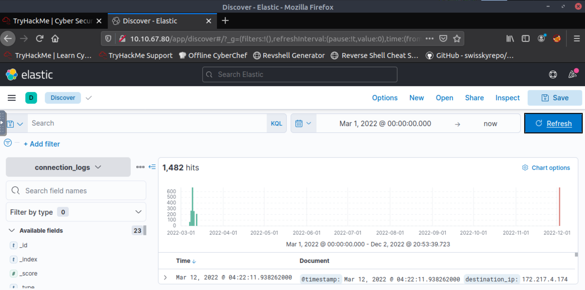
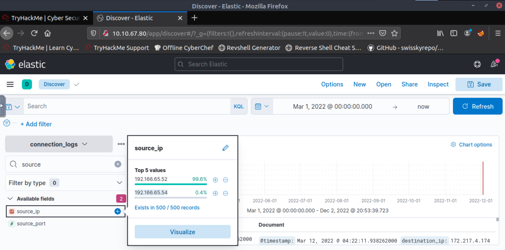
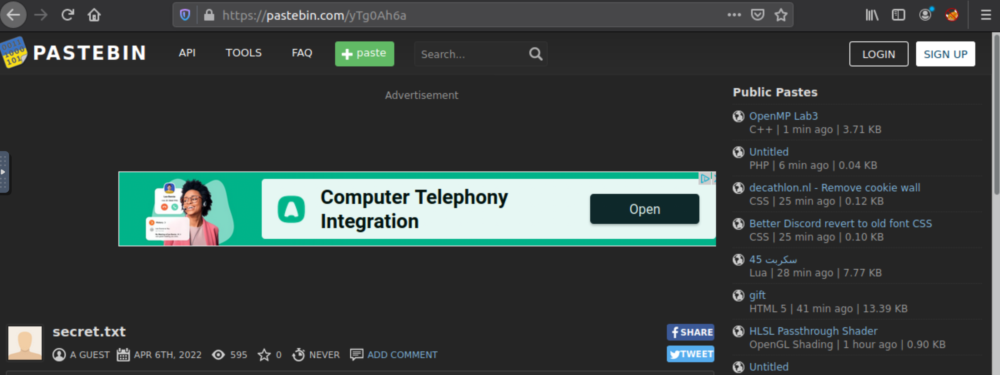

# ItsyBitsy

## Scenario

During normal SOC monitoring, Analyst John observed an alert on an IDS solution indicating a potential C2 communication 
from a user Browne from the HR department. A suspicious file was accessed containing a malicious pattern 
`THM:{ ________ }`. A week-long HTTP connection logs have been pulled to investigate. Due to limited resources, 
only the connection logs could be pulled out and are ingested into the `connection_logs` index in Kibana.

Examine the network connection logs of this user, find the link and the content of the file, and answer the questions.

`Unable to connect ... will do later.`

## Questions

**How many events were returned for the month of March 2022?**

|  |
|:----------------------------------------------:|
|                     `1482`                     |

**What is the IP associated with the suspected user in the logs?**

|  |
|:------------------------------------------:|
|              `192.166.65.54`               |

**The user’s machine used a legit windows binary to download a file from the C2 server. What is the name of the binary?**

|  |
|:---------------------------------------------------:|
|                     `bitsadmin`                     |

The infected machine connected with a famous filesharing site in this period, which also acts as a C2 server used by the malware authors to communicate. 
**What is the name of the filesharing site?**

|  |
|:--------------------------------------------------------:|
|                      `pastebin.com`                      |

**What is the full URL of the C2 to which the infected host is connected?**

|  |
|:------------------------------------------------:|
|             `pastebin.com/yTg0Ah6a`              |

**A file was accessed on the filesharing site. What is the name of the file accessed?**

|  |
|:------------------------------------------------:|
|                   `secret.txt`                   |

**The file contains a secret code with the format `THM{_____}`.**

Scroll down to see contents of `secret.txt`

