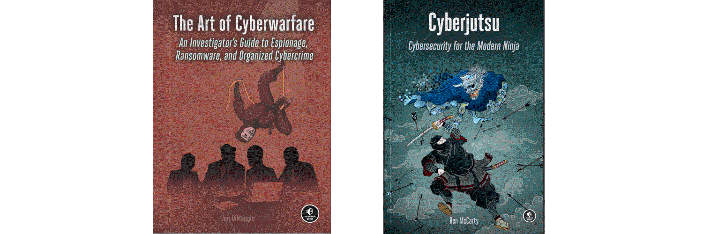

Security information and event management
=====================================================================

These are notes and challenges on security information and event management (SIEM), vulnerability management, threat intelligence and management, and on threat hunting.

Threat hunting is complementary to the standard process of incident detection, response, and remediation, and is the practice of proactively searching for cyber threats that may be hidden in a network.

----

.. toctree::
   :maxdepth: 1
   :includehidden:
   :caption: Testlab

   Security information and event management tools <https://testlab.tymyrddin.dev/docs/siem/README>
   Threat intelligence tools <https://testlab.tymyrddin.dev/docs/cti/README>
   Threat hunting tools <https://testlab.tymyrddin.dev/docs/hunting/README>
   Vulnerability management tools <https://testlab.tymyrddin.dev/docs/tvm/README>

----

.. toctree::
   :maxdepth: 1
   :includehidden:
   :caption: Notes

   docs/notes/README.md
   docs/notes/standards.md
   docs/notes/frameworks.md
   docs/notes/siem.md
   docs/notes/hunting.md

----

.. toctree::
   :glob:
   :maxdepth: 1
   :includehidden:
   :caption: Incident handling with Splunk

   docs/incident/README.md
   docs/incident/scenario.md
   docs/incident/recon.md
   docs/incident/exploit.md
   docs/incident/install.md
   docs/incident/objectives.md
   docs/incident/c2.md
   docs/incident/weaponise.md
   docs/incident/deliver.md

----

.. toctree::
   :glob:
   :maxdepth: 1
   :includehidden:
   :caption: TryHackMe challenges

   docs/thm/README.md
   docs/thm/vpn.md
   docs/thm/itsybitsy.md
   docs/thm/investigation.md
   docs/thm/benign.md
   docs/thm/caddywiper.md
   docs/thm/zerologon.md

----

.. toctree::
   :glob:
   :maxdepth: 1
   :includehidden:
   :caption: CyberDefenders challenges

   docs/cd/README.md
   docs/cd/grabthefisher.md
   docs/cd/lespion.md
   docs/cd/intel101.md
   docs/cd/casevegas.md
   docs/cd/cybercorp2.md

----

.. toctree::
   :glob:
   :maxdepth: 1
   :includehidden:
   :caption: Boss of the SOC v2

   docs/bots/README.md
   docs/bots/data.md
   docs/bots/100.md
   docs/bots/200.md
   docs/bots/300.md
   docs/bots/400.md

----

.. toctree::
   :maxdepth: 1
   :includehidden:
   :caption: Resources

   docs/resources/README.md
   docs/resources/maps.md
   docs/resources/feeds.md
   docs/resources/blogs.md
   docs/resources/reports.md
   docs/resources/markets.md

----

Books
---------------------------

